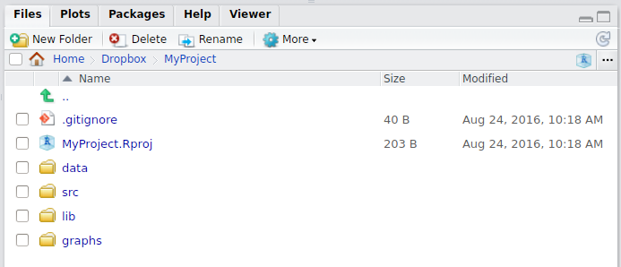

---

---

## Install R
As you can guess, it's very straightforward: download and install **R** for your operation system from [https://cran.r-project.org/](https://cran.r-project.org/). 

## Install RStudio
> RStudio is a set of integrated tools designed to help you be more productive with R. It includes a console, syntax-highlighting editor that supports direct code execution, as well as tools for plotting, history, debugging and workspace management.

Download and install **RStudio** from [https://www.rstudio.com/](https://www.rstudio.com/)


### Setup your project
To get started using R via RStudio it is suggested to organise your work to projects. Each project has their own working directory, workspace, history, and source documents.
In order to create a new project:

1. Open RStudio
2. Select `Project` menu from the **upper right corner** and either create `New Project` or `Open Project`. [RStudio support page for using projects](https://support.rstudio.com/hc/en-us/articles/200526207-Using-Projects). 


When you open a project in RStudio several actions are taken:

+ A fresh new R session is started
+ The current working directory is set to the project directory.
+ Previously edited source documents are restored into editor tabs.
+ The `.Rprofile` file in the project's main directory (if any) is sourced by R, also the `.RData` and `.Rhistory` files in the project's main directory are loaded.
+ Other RStudio settings (e.g. active tabs, splitter positions, etc.) are restored to where they were the last time the project was closed.

### Folder structure of R project

+ Create a directory structure to separate R code, data, reports, and output
+ __Treat data as read-only__: do data-munging in R code, but always start with the source data
+ __Consider output figures and tables as disposable__: the data plus the R script is the canonical source
+ __Keep function definitions and applications code separately__



```{r, eval=FALSE}
MyProject/
  |-- scripts/ # contains R script
  |-- data/ # contains raw data, read only
  |-- output or results/ # contains R functions (R scipts defining functions)
  |-- plots, graphs or figures/ # output graphs
  |-- report.Rmd # expected to be in project root
```

Where am I?
```{r, eval=FALSE}
getwd() # shows active working directory.
```

Using **R projects** together with **here** <https://here.r-lib.org> package in your scripts makes `getwd()` and `setwd()` useless.   

> There is a blue cube button in files tab in RStudio that directs you back to your project folder.


### Getting help

You can get help for individual functions from R Documentation at the program's command prompt by preceding R command with ?.
```{r help}
?getwd()
```

Package documentation with list of all included functions can be accessed like this:
```{r}
library(help = "readxl")
```


In RStudio if you type the name of the function without parentheses eg. `scale` and hit the `F1` key, the help page of the function is shown in the lower right panel.

### Tips and tricks
+ RStudio: `Help` menu contains section `Cheatsheets`.
+ `Ctrl + Enter` (`Cmd + Enter` on a Mac) in RStudio: sends the current line (or current selection) from the editor to the console and runs it. 
+ `Alt + -` in RStudio: gives assignment operator `<-`. 
+ `Ctrl + Shift + M` (Shift + Cmd + M on a Mac) in RStudio: gives piping operator `%>%`. 
+ `Ctrl + Shift + C` (Ctrl + Cmd + C on a Mac) in RStudio: comment/uncomment lines.
+ [RStudio cheat sheet with more tips](https://www.rstudio.com/wp-content/uploads/2016/01/rstudio-IDE-cheatsheet.pdf).
+ R is case-sensitive. 
+ Enter commands one at a time at the console or run a set of commands from the editor. 
+ Object names and column names cannot begin with a number. 
+ No spaces in object names! (use `.` or `_` or `-`).
+ Using the backslash `\` in a pathname on Windows -- R sees the `\` as an escape character. `setwd("C:\mydata")` generates an error. Use `setwd("C:/mydata")` or `setwd("C:\\mydata")` instead.


