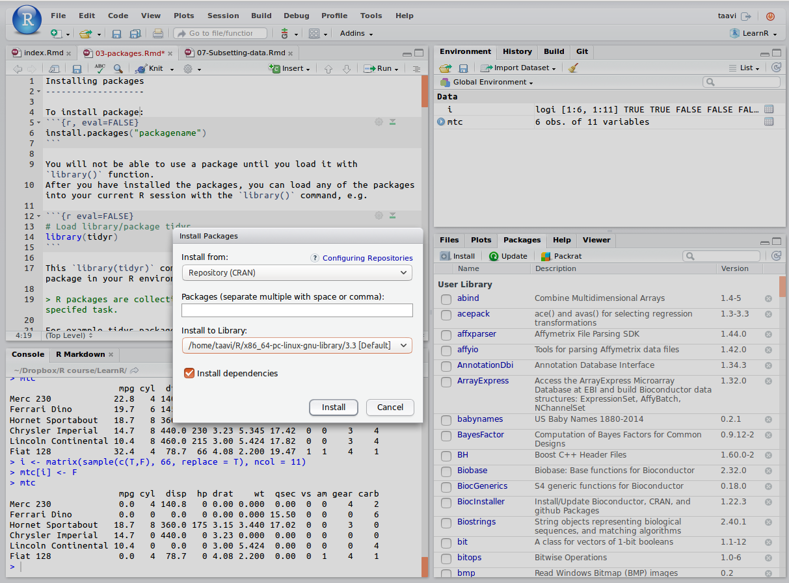

# Installing packages

To install package, run following command in your R console:
```{r, eval=FALSE}
install.packages("packagename") # eg use "ggplot2" as packagename
```
RStudio offers also point-and-click style package install option:

```{r, fig.cap="Install packages via RStudio GUI."}

```

You will not be able to use a package until you load it with the `library()` function. 
After you have installed the packages, you can load any of the packages into your current R session with the `library()` command, e.g. 

```{r eval=FALSE}
# Load library/package tidyr
library(tidyr)
```

The `library(tidyr)` command makes available all the funtions in the tidyr package.

> R packages are collections of one or more functions with clearly specifed task. 

For example, the tidyr package contains following `r library(tidyr); length(ls("package:tidyr"))` functions:

```{r}
library(tidyr)
ls("package:tidyr")
```


## R repositories
R packages are available from 3 major repositories:

1. __CRAN__ 

```{r eval=FALSE}
install.packages("ggplot2")
```

2. __Bioconductor__ [https://www.bioconductor.org/](https://www.bioconductor.org/)

```{r eval=FALSE}
# First run biocLite script fron bioconductor.org
source("https://bioconductor.org/biocLite.R")  
# use 'http' in url if 'https' is unavailable. 
biocLite("GenomicRanges", suppressUpdates=TRUE)
```

3. __GitHub__ [https://github.com/](https://github.com/)

```{r eval=FALSE}
library(devtools)
install_github("ramnathv/slidify") # ramnathv is the user, slidify the package.
# or alternatively, should we want only to install the missing package while avoiding any side effects that might result from loading the entire package, we use: 
devtools::install_github("ramnathv/slidify")
```

also 

4. `library(remotes)`: functions to install R packages from GitHub, Bitbucket, git, svn repositories, URL-s (also devtools package has functions to install packages from these resources).

> NB! As we want to add extra data munging power to the base R, in our course, every R session should start with loading these packages:

```{r eval=FALSE}
library(dplyr)
library(tidyr)
library(reshape2)
library(ggplot2)
library(tibble)
```


## Search for R functions

To find a function containing the word "mutate" in any package:

```{r eval=FALSE}
RSiteSearch("mutate", restrict = "functions") # this function is avaible from base R
```

will search online to find matches and will open a web browser to display the results. 


The function `apropos()` will search any **loaded** R packages for a given term. 
To find functions for creating a confusion matrix within the currently loaded packages:

```{r, echo=FALSE, message=FALSE}
help_console <- function(topic, format=c("text", "html", "latex", "Rd"),
                         lines=NULL, before=NULL, after=NULL) {  
  format=match.arg(format)
  if (!is.character(topic)) topic <- deparse(substitute(topic))
  helpfile = utils:::.getHelpFile(help(topic))

  hs <- capture.output(switch(format, 
                              text=tools:::Rd2txt(helpfile),
                              html=tools:::Rd2HTML(helpfile),
                              latex=tools:::Rd2latex(helpfile),
                              Rd=tools:::prepare_Rd(helpfile)
                              )
                      )
  if(!is.null(lines)) hs <- hs[lines]
  hs <- c(before, hs, after)
  cat(hs, sep="\n")
  invisible(hs)
}
```


```{r}
library(dplyr) # lets load package caret
apropos("select") #  search loaded R packages for a word 'confusion'
```


```{r, echo=1}
help("mutate") # same as ?
```


## Common mistakes in loading packages

+ Using the wrong case: help(), Help(), and HELP() - only the first will work.
+ Forgetting quotation marks -- `install.packages("gclus")` works.
+ Using a function from a package that's not loaded: library("foo")
+ Forgetting to include the parentheses in a function call. For example `help()` works, but `help` doesn't. 

> Entering function name without parentheses returns function internals. Very useful!

```{r}
ruut  <- function(x) x^2 # lets define function
ruut # display function internals
ruut(3) # run function
```

<!-- Even if there are no **function arguments**, you still need the `()` appended to function name to execute function. -->

<!-- ```{r} -->
<!-- twoplustwo <- function() 2+2 # here we define our function -->
<!-- twoplustwo # lets see whats in it -->
<!-- twoplustwo() # run function -->
<!-- ``` -->

