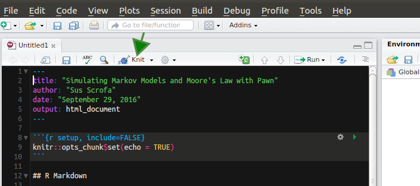

# Reports with rmarkdown
R markdown is a variant of markdown that has embedded R code chunks. R markdown allows you to combine your R code, producing statistics and plots, with write-up. With the help of knitr and pandoc R markdown documents can be converted into reports in html, pdf or MS word format.

[Quick overview of R markdown document, what it contains and how its structure looks like.](http://kbroman.org/knitr_knutshell/pages/Rmarkdown.html)

[R markdown cheatsheet](https://www.rstudio.com/wp-content/uploads/2016/03/rmarkdown-cheatsheet-2.0.pdf). 

**This is how basic rmarkdown document template looks like in RStudio:**
<pre><code>---
title: "Untitled"
output: html_document
---

```{r setup, include=FALSE}
knitr::opts_chunk$set(echo = TRUE)
```

## R Markdown

This is an R Markdown document. Markdown is a simple formatting syntax for authoring HTML, PDF, and MS Word documents. For more details on using R Markdown see <http://rmarkdown.rstudio.com>.

When you click the **Knit** button a document will be generated that includes both content as well as the output of any embedded R code chunks within the document. You can embed an R code chunk like this:

```{r cars}
summary(cars)
```

## Including Plots

You can also embed plots, for example:

```{r pressure, echo=FALSE}
plot(pressure)
```

Note that the `echo = FALSE` parameter was added to the code chunk to prevent printing of the R code that generated the plot.</code></pre>

### YAML
Lets break down this document, first part, embedded between double `---` is YAML header. We can pass additional arguments to header, like author or date:

<pre><code>---
title: "Reproducible Data Analysis in R"
author: "Ülo Maiväli^1^, Taavi Päll^2^"
date: "`r Sys.Date()`" 
output:
  html_document:
    theme: journal
    highlight: pygments
    toc: true
    toc_float: true
    toc_depth: 4
---</code></pre>

Note that above, date is returned as `Sys.Date()` using R code, but it could be much simpler, like "29. september 2016". If you run Knit from RStudio **all fields in YAML are optional**. Default `output: html_document` specifies .html output, `pdf_document` and `word_document` specify that .pdf and .docx ,respectively, is genereated by pandoc.

### Code chunks
Most important parts of R markdown document are R code chunks, which look like this:

<pre><code>
```{r plotnorm}
x <- rnorm(100)
boxplot(x)
```
</code></pre>

R markdown chunks start with triple backticks, followed by `{r}`: 
<pre><code>
```{r chunkname}
</code></pre>

Then comes your R code.
And chunk ends with triple backticks (grave accent):
<pre><code>
```
</code></pre>

An R Markdown document usually contains many code chunks. All consequtive chunks are evaluated in order of appearance in a single R session. All objects generated will be preserved in future chunks. It's like running source on your R file without interleaved text. In fact, you can pull out only R code from your R markdown file using knitr command `purl`.

### Chunk options
Chunk output can be customized with knitr [options](http://yihui.name/knitr/options/), arguments set in the `{}` of a chunk header. Some of the frequently used chunk options:

+ `include = FALSE` prevents code and results from appearing in the finished file. R Markdown still runs the code in the chunk, and the results can be used by other chunks.
+ `echo = FALSE` prevents code, but not the results from appearing in the finished file. This is a useful way to embed figures.
+ `message = FALSE` prevents messages that are generated by code from appearing in the finished file.
+ `warning = FALSE` prevents warnings that are generated by code from appearing in the finished.
+ `fig.cap = "..."` adds a figure caption.


To knit this rmarkdown document into a html, pdf or word document hit `Knit` button in the head of source file window in RStudio:




