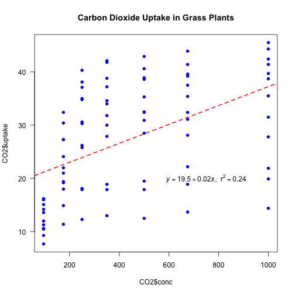

```r
---
title: "Reproducible Data Analysis in R"
author: "Ülo Maiväli^1^, Taavi Päll^2^"
date: "`r Sys.Date()`" 
output:
  html_document:
    theme: journal
    highlight: pygments
    toc: true
    toc_float: true
    toc_depth: 4
---
```

```
## Error: <text>:14:0: unexpected end of input
## 12: ---
## 13: 
##    ^
```


^1^[University of Tartu, Institute of Technology](http://www.tuit.ut.ee/en), 
^2^[Tallinn University of Technology, Department of Gene Technology](http://www.ttu.ee/faculty-of-science/department-of-gene-technology/)


# Introduction

R is [functional programming language](https://en.wikipedia.org/wiki/Functional_programming) and [statistical environment](https://www.r-project.org/about.html).

## About
R statistical language is based on **S** (R is [GNU](https://en.wikipedia.org/wiki/GNU) S). 
S was developed by John Chambers (mainly), Rick Becker and Allan Wilks of Bell Laboratories. 
The first version of S saw light in 1976. 
The aim of the S language was "to turn ideas into software, quickly and faithfully".
R was initially written by Robert Gentleman and Ross Ihaka at the University of Auckland Statistics Department. 
The project is relatively new, conceived in 1992, with an initial version released in 1994 and a first stable beta version in 2000.


### R pros

+ Just about any type of data analysis can be done in R. 


+ R contains advanced statistical routines not yet available in other packages \@ref(fig:plotcranpackages).  
+ R provides reproducibility in data analysis, and yet is very flexible (everyone can write their parallel solution to any problem). 
+ R has the most comprehensive feature set available to visualize complex data. 
+ The results of any analytic step can easily be saved, manipulated, and used as input for additional analyses. 
+ R can import/export data from text files, pdf-s, database-management systems, statistical packages, and specialized data stores. 
+ R can also access data directly from web pages, social media sites, and a wide range of online data services.  
+ R provides a natural language for quickly programming recently published methods.  
+ Most operations in R are much quicker than manipulating tables in MS Excel or LO Calc. 
+ R has a large community of users -- most questions can be quickly answered by googling.  
+ For a non-programmer R is easier to learn than Python, etc. (Ülo: most users do not program in R, and don't need to.)  

A key reason that R is a good thing is because it is a language. The power of language is abstraction. The way to make abstractions in R is to write functions [(Burns, 2011)](http://www.burns-stat.com/pages/Tutor/R_inferno.pdf).

### R cons (none is the deal breaker):

+ With R you must know exactly, what you want to do – in terms of your immediate atomic goals in data massage, methods of statistical analysis, and the overall strategy of analysis. 
+ It is **like getting your own keys to daddy's F-16 fighter plane**. Get a setting wrong **and boom!**

](http://nkpzz1l56ai473pu632f0nui.wpengine.netdna-cdn.com/wp-content/uploads/2015/01/amazing-model-airplane-remote-control-replica-of-dutch-orange-f-16-fighter-jet-672x377.jpg)

+ R has uneven inbuilt help – but a lot of users who are willing to help you.

### Alternatives
You can prepend "Some say, .." to these statements:

+ MS Excel might be better for inputting data into tables.
+ Graphpad Prism is much more foolproof and easier to use as a statistical tool (but has limited functionality). There is a free web version of Graphpad – [check it out](http://www.graphpad.com/quickcalcs/).  
+ Python is more widely spread as a general purpose programming language -- it is also arguably better in working with external databases (which we won't). 
 

## Install R
As you can guess, it's very straightforward: download and install **R** for your operation system from [https://cran.r-project.org/](https://cran.r-project.org/). 

## Install RStudio
> RStudio is a set of integrated tools designed to help you be more productive with R. It includes a console, syntax-highlighting editor that supports direct code execution, as well as tools for plotting, history, debugging and workspace management.

Download and install **RStudio** from [https://www.rstudio.com/](https://www.rstudio.com/)


### Setup your project
To get started using R via RStudio it is suggested to organise your work to projects. Each project has their own working directory, workspace, history, and source documents.
In order to create a new project:

1. Open RStudio
2. Select `Project` menu from the **upper right corner** and either create `New Project` or `Open Project`. [RStudio support page for using projects](https://support.rstudio.com/hc/en-us/articles/200526207-Using-Projects). 


When you open a project in RStudio several actions are taken:

+ A fresh new R session is started
+ The current working directory is set to the project directory.
+ Previously edited source documents are restored into editor tabs.
+ The `.Rprofile` file in the project's main directory (if any) is sourced by R, also the `.RData` and `.Rhistory` files in the project's main directory are loaded.
+ Other RStudio settings (e.g. active tabs, splitter positions, etc.) are restored to where they were the last time the project was closed.

### Folder structure of R project

+ Create a directory structure to separate R code, data, reports, and output
+ __Treat data as read-only__: do data-munging in R code, but always start with the source data
+ __Consider output figures and tables as disposable__: the data plus the R script is the canonical source
+ __Keep function definitions and applications code separately__


```r
MyProject/
  |-- src/ # contains R script
  |-- data/ # contains raw data, read only
  |-- lib/ # contains R functions (R scipts defining functions)
  |-- graphs/ # output graphs
```

Where are we?

```r
getwd() # Prints the current working directory
```

```
## [1] "/Users/taavi/Dropbox/learn-r"
```

But if you want set working directory by your self:

```r
# Sets working directory, into which things are saved by default and from which stuff is imported
setwd("/Users/ulomaivali/Dropbox/") # mac
setwd("C:/Users/ulomaivali/Dropbox/") # windows
setwd("~/Dropbox/R course/") # linux, ~/ references to user home directory
```


### Getting help

You can get help for individual functions from R Documentation at the program's command prompt by preceding R command with ?.

```r
?getwd()
```

Package documentation with list of all included functions can be accessed like this:

```r
library(help = "readxl")
```


In RStudio if you type the name of the function without parentheses eg. `scale` and hit the `F1` key, the help page of the function is shown in the lower right panel.

### Tips and tricks
+ RStudio: `Help` menu contains section `Cheatsheets`.
+ `Ctrl + Enter` (`Cmd + Enter` on a Mac) in RStudio: sends the current line (or current selection) from the editor to the console and runs it. 
+ `Alt + -` in RStudio: gives assignment operator `<-`. 
+ `Ctrl + Shift + M` (Shift + Cmd + M on a Mac) in RStudio: gives piping operator `%>%`. 
+ `Ctrl + Shift + C` (Ctrl + Cmd + C on a Mac) in RStudio: comment/uncomment lines.
+ [RStudio cheat sheet with more tips](https://www.rstudio.com/wp-content/uploads/2016/01/rstudio-IDE-cheatsheet.pdf).
+ R is case-sensitive. 
+ Enter commands one at a time at the console or run a set of commands from the editor. 
+ Object names and column names cannot begin with a number. 
+ No spaces in object names! (use `.` or `_` or `-`).
+ Using the backslash `\` in a pathname on Windows -- R sees the `\` as an escape character. `setwd("C:\mydata")` generates an error. Use `setwd("C:/mydata")` or `setwd("C:\\mydata")` instead.


 
## Installing packages

To install package, run following command in your R console:

```r
install.packages("packagename") # eg use "ggplot2" as packagename
```
RStudio offers also point-and-click style package install option:


You will not be able to use a package until you load it with the `library()` function. 
After you have installed the packages, you can load any of the packages into your current R session with the `library()` command, e.g. 

```r
# Load library/package tidyr
library(tidyr)
```

The `library(tidyr)` command makes available all the funtions in the tidyr package.

> R packages are collections of one or more functions with clearly specifed task. 

For example, the tidyr package contains following 41 functions:

```r
library(tidyr)
ls("package:tidyr")
```

```
##  [1] "%>%"             "complete"        "complete_"      
##  [4] "crossing"        "crossing_"       "drop_na"        
##  [7] "drop_na_"        "expand"          "expand_"        
## [10] "extract"         "extract_"        "extract_numeric"
## [13] "fill"            "fill_"           "full_seq"       
## [16] "gather"          "gather_"         "nest"           
## [19] "nest_"           "nesting"         "nesting_"       
## [22] "population"      "replace_na"      "separate"       
## [25] "separate_"       "separate_rows"   "separate_rows_" 
## [28] "smiths"          "spread"          "spread_"        
## [31] "table1"          "table2"          "table3"         
## [34] "table4a"         "table4b"         "table5"         
## [37] "unite"           "unite_"          "unnest"         
## [40] "unnest_"         "who"
```


## R repositories
R packages are available from 3 major repositories:

1. __CRAN__ 

```r
install.packages("ggplot2")
```

2. __Bioconductor__ [https://www.bioconductor.org/](https://www.bioconductor.org/)

```r
# First run biocLite script fron bioconductor.org
source("https://bioconductor.org/biocLite.R")  
# use 'http' in url if 'https' is unavailable. 
biocLite("GenomicRanges", suppressUpdates=TRUE)
```

3. __GitHub__ [https://github.com/](https://github.com/)

```r
library(devtools)
install_github("ramnathv/slidify") # ramnathv is the user, slidify the package.
# or alternatively, should we want only to install the missing package while avoiding any side effects that might result from loading the entire package, we use: 
devtools::install_github("ramnathv/slidify")
```

or

```r
install.packages("githubinstall")
library(githubinstall)
githubinstall("AnomalyDetection")
```

also 

4. `library(remotes)`: functions to install R packages from GitHub, Bitbucket, git, svn repositories, URL-s (also devtools package has functions to install packages from these resources).


> NB! As we want to add extra data munging power to the base R, in our course, every R session should start with loading these packages:

```r
library(dplyr)
library(tidyr)
library(reshape2)
library(ggplot2)
library(tibble)
```


### Search for R functions

To find a function containing the word "confusion" in any package:

```r
RSiteSearch("confusion", restrict = "functions") # this function is avaible from base R
```

will search online to find matches and will open a web browser to display the results. 


The function `apropos()` will search any **loaded** R packages for a given term. 
To find functions for creating a confusion matrix within the currently loaded packages:

```r
library(caret) # lets load package caret
```

```
## Loading required package: lattice
```

```r
apropos("confusion") #  search loaded R packages for a word 'confusion'
```

```
## [1] "confusionMatrix"       "confusionMatrix.train"
```

```r
help("confusionMatrix") # same as ?, only lines 1-25 are shown here
```

```
## _C_r_e_a_t_e _a _c_o_n_f_u_s_i_o_n _m_a_t_r_i_x
## 
## _D_e_s_c_r_i_p_t_i_o_n:
## 
##      Calculates a cross-tabulation of observed and predicted classes
##      with associated statistics.
## 
## _U_s_a_g_e:
## 
##      confusionMatrix(data, ...)
##      
##      ## Default S3 method:
##      confusionMatrix(data, reference, positive = NULL, 
##                      dnn = c("Prediction", "Reference"), 
##                      prevalence = NULL,  mode = "sens_spec", ...)
##      
##      ## S3 method for class 'table'
##      confusionMatrix(data, positive = NULL, prevalence = NULL, mode = "sens_spec", ...)
##      
## _A_r_g_u_m_e_n_t_s:
## 
##     data: a factor of predicted classes (for the default method) or an
##           object of class 'table'.
## 
## reference: a factor of classes to be used as the true results
```


### Common mistakes in loading packages

+ Using the wrong case: help(), Help(), and HELP() - only the first will work.
+ Forgetting quotation marks -- `install.packages("gclus")` works.
+ Using a function from a package that's not loaded: library("foo")
+ Forgetting to include the parentheses in a function call. For example `help()` works, but `help` doesn't. 

> Entering function name without parentheses returns function internals. Very useful!

```r
ruut  <- function(x) x^2 # lets define function
ruut # display function internals
```

```
## function(x) x^2
```

```r
ruut(3) # run function
```

```
## [1] 9
```

<!-- Even if there are no **function arguments**, you still need the `()` appended to function name to execute function. -->

<!-- ```{r} -->
<!-- twoplustwo <- function() 2+2 # here we define our function -->
<!-- twoplustwo # lets see whats in it -->
<!-- twoplustwo() # run function -->
<!-- ``` -->
 


# R objects

An R object is anything that can be assigned a value (data, functions, graphs, analytic results, and more). 
Every object has a class attribute telling R how to handle it. 
Common R data structures are: vectors (numerical, character, logical), matrices, data frames, and lists.
The basic data structure in R is the vector.

### Class of object
An R vector is characterized by a mode that describes its contents: logical, numeric, complex, character.

An R data structure is characterized by a class that describes its structure: matrix, array, factor, time-series, data frame, and list.

To determine the class of your object use `class(object)` - prints the class attribute of an object.

```r
myobject <- list(1,"a")
class(myobject) # gives the data structure of object 'myobject'
```

```
## [1] "list"
```

### R expressions
Syntactically correct R expressions (`y <- x * 10`) will be referred to as statements.
R uses the symbol `<-` for assignments, rather than the typical `=` sign.

Here we create a vector named `x` containing five random numbers from a standard normal distribution.

```r
x <- rnorm(5)
x
```

```
## [1]  0.7218642 -0.3979102 -0.3774201  1.0227348 -1.6430232
```

```r
y <- x * 10 # here we multiply numeric vector x by 10
y
```

```
## [1]   7.218642  -3.979102  -3.774201  10.227348 -16.430232
```

### Assigning value to object

`a` is an object containing character "b": 

```r
a <- "b"
a
```

```
## [1] "b"
```


<script async src="https://platform.twitter.com/widgets.js" charset="utf-8"></script>
<blockquote class="twitter-tweet" data-lang="en"><p lang="en" dir="ltr">In <a href="https://twitter.com/hashtag/rstats?src=hash">#rstats</a>, it&#39;s surprisingly important to realise that names have objects; objects don&#39;t have names <a href="https://t.co/bEMO1YVZX0">pic.twitter.com/bEMO1YVZX0</a></p>&mdash; Hadley Wickham (@hadleywickham) <a href="https://twitter.com/hadleywickham/status/732288980549390336">May 16, 2016</a>
</blockquote>


You can overwrite objects (assign a new value to it):

```r
a <- c("poodle","sheltie") # c(1,2) is a vector 
a # a now contains two values: "poodle" and "sheltie"
```

```
## [1] "poodle"  "sheltie"
```


You can copy objects under new name: 

```r
b <- a
b
```

```
## [1] "poodle"  "sheltie"
```

You can use output of `function 1` as input to `function 2`:

```r
foo <- function(x) x^4 # function 1
foo(x = 2)
```

```
## [1] 16
```

```r
d <- sqrt(foo(2)) # function 'sqrt' calculates square root
d
```

```
## [1] 4
```

> Never use a function name as object name -- `c` vs. `c()`. You rewrite that function in your environment and you get into trouble!

### Coercing

```r
a <- "42"
a
```

```
## [1] "42"
```

```r
class(a)
```

```
## [1] "character"
```

```r
b <- as.numeric(a)
b
```

```
## [1] 42
```

```r
class(b)
```

```
## [1] "numeric"
```

```r
b <- as.factor(a)
b
```

```
## [1] 42
## Levels: 42
```

```r
class(b)
```

```
## [1] "factor"
```


To coerce the factor `ss` with two levels `10` and `20` into numbers you must convert it to character first: 

```r
ss <- as.factor(c(10,20))
ss
```

```
## [1] 10 20
## Levels: 10 20
```

```r
# lets see what happens if we try to convert ss directly to numeric
as.numeric(ss)
```

```
## [1] 1 2
```

```r
as.numeric(as.character(ss))
```

```
## [1] 10 20
```

Factor variables are encoded as integers in their underlying representation. So a variable like "poodle" and "sheltie" will be encoded as 1 and 2 in the underlying representation [more about factors and stringsAsFactors option when importing a data.frame](http://simplystatistics.org/2015/07/24/stringsasfactors-an-unauthorized-biography/).

Factors are used to group data by their levels for analysis (e.g. linear model: `lm()`) & graphing. 
In earlier versions of R, storing character data as a factor was more space efficient if there is even a small proportion of repeats. However, identical character strings now share storage, so the difference is small in most cases. 
Nominal variables are categorical, without an implied order. 

```r
diabetes <- c("Type1", "Type2", "Type1", "Type1") # diabetes is a factor with 2 levels
diabetes # a character vector
```

```
## [1] "Type1" "Type2" "Type1" "Type1"
```

```r
class(diabetes)
```

```
## [1] "character"
```

```r
diabetes <- factor(diabetes) # coerce to factor
diabetes # factors
```

```
## [1] Type1 Type2 Type1 Type1
## Levels: Type1 Type2
```

```r
class(diabetes)
```

```
## [1] "factor"
```

Encoding `diabetes` vector as a factor stores this vector as 1, 2, 1, 1 and associates it with 1 = Type1 and 2 = Type2 internally (the assignment is alphabetical).
Any analyses performed on the vector diabetes will treat the variable as nominal and select the statistical methods appropriate for this level of measurement.    


Ordinal variables imply order but not amount. 
`Status (poor, improved, excellent)`. 
For vectors representing ordinal variables, add `ordered = TRUE` to the `factor()` function. 

```r
status <- c("Poor", "Improved", "Excellent", "Poor")
status
```

```
## [1] "Poor"      "Improved"  "Excellent" "Poor"
```

For ordered factors, override the alphabetic default by specifying levels. 

```r
status <- factor(status, ordered = TRUE, levels = c("Poor", "Improved", "Excellent")) # Assigns the levels as 1 = Poor, 2 = Improved, 3 = Excellent. 
status
```

```
## [1] Poor      Improved  Excellent Poor     
## Levels: Poor < Improved < Excellent
```

Continuous variables have order & amount (`class: numeric or integer`). 
Numeric variables can be re-coded as factors. 
If sex was coded as 1 for male and 2 for female in the original data, 

```r
sex <- sample(c(1,2), 21, replace = TRUE) # lets generate data
sex
```

```
##  [1] 1 1 2 1 1 1 2 1 1 2 1 1 2 1 2 2 1 1 2 1 1
```

then, `factor()` converts the variable to an unordered factor.    
The order of the labels must match the order of the levels. 
Sex would be treated as categorical, the labels "Male" and "Female" would appear in the output instead of 1 and 2

```r
sex <- factor(sex, levels = c(1, 2), labels = c("Male", "Female"))
sex
```

```
##  [1] Male   Male   Female Male   Male   Male   Female Male   Male   Female
## [11] Male   Male   Female Male   Female Female Male   Male   Female Male  
## [21] Male  
## Levels: Male Female
```
 

# Data structures 

+ **Atomic vectors** are arrays that contain a single data type (logical, real, complex, character). 
Each of the following is a one-dimensional atomic vector: 

```r
passed <- c(TRUE, FALSE, FALSE, FALSE, TRUE, TRUE, TRUE) # random sequence
class(passed)
```

```
## [1] "logical"
```

```r
ages <- c(53, 51, 25, 67, 66, 41, 62, 42) # random numbers
class(ages)
```

```
## [1] "numeric"
```

```r
namez <- c("Marina", "Allar", "Siim", "Mart", "Mailis", "Eiki", "Urmas") # random names, names is R function!
class(namez)  
```

```
## [1] "character"
```

A scalar is an atomic vector with a single element. 
So `k <- 2` is a shortcut for `k <- c(2)`.

+ A **matrix** is an atomic vector that has a dimension attribute, `dim()`, containing two elements (`nrow`, number of rows and `ncol`, number of columns) 

```r
matrix(ages, nrow = 2)
```

```
##      [,1] [,2] [,3] [,4]
## [1,]   53   25   66   62
## [2,]   51   67   41   42
```

+ **Lists** are collections of atomic vectors and/or other lists.

```r
mylist <- list(passed, ages, namez)
mylist
```

```
## [[1]]
## [1]  TRUE FALSE FALSE FALSE  TRUE  TRUE  TRUE
## 
## [[2]]
## [1] 53 51 25 67 66 41 62 42
## 
## [[3]]
## [1] "Marina" "Allar"  "Siim"   "Mart"   "Mailis" "Eiki"   "Urmas"
```

We can assign names to list objects:

```r
names(mylist) <- c("passed", "ages", "namez")
mylist
```

```
## $passed
## [1]  TRUE FALSE FALSE FALSE  TRUE  TRUE  TRUE
## 
## $ages
## [1] 53 51 25 67 66 41 62 42
## 
## $namez
## [1] "Marina" "Allar"  "Siim"   "Mart"   "Mailis" "Eiki"   "Urmas"
```

+ **Data frames** are a special type of list, where each atomic vector in the collection has the same length. 
Each vector represents a column (variable) in the data frame.

```r
exam <- data.frame(name = namez, passed = passed)
exam
```

```
##     name passed
## 1 Marina   TRUE
## 2  Allar  FALSE
## 3   Siim  FALSE
## 4   Mart  FALSE
## 5 Mailis   TRUE
## 6   Eiki   TRUE
## 7  Urmas   TRUE
```

 ](https://raw.githubusercontent.com/Anonymous-Y/BlogImage/master/r-intro-3.jpg)

## Selecting by index
Index gives the address that specifies the elements of vector/matrix/list or data.frame, which are then automatically selected.

+ Indexing begins at 1 (not 0) in R
+ Indexing operators in R are square brackets -- '[', `[[` and dollar sign `$`  
+ `[` allows selecting more than one element, whereas `[[` and `$` select only one element.
+ Empty index [,] means "select all" -- `a[,1]` means "select all rows and 1st column from `a`".

<!-- ```{r} -->
<!-- '['(c(1,2,3), 1) == c(1,2,3)[1] # as you can see these are both identical -->
<!-- ``` -->

<!-- + you can select values, rows or columns by index -->

<!-- + `-` (minus) before index means "not this element" -->
<!-- + ! means "not" -->
<!-- + != means "not equal" -->
<!-- + == means "equal" -->

During initial data exploration it is often necessary to have a look how the head of your table looks like, for this you can use convenience methods `head` and `tail` which are returning first and last elements of a object, respectively:

```r
head(mtcars) # Prints first 6 elements (rows) as default
```

```
##                    mpg cyl disp  hp drat    wt  qsec vs am gear carb
## Mazda RX4         21.0   6  160 110 3.90 2.620 16.46  0  1    4    4
## Mazda RX4 Wag     21.0   6  160 110 3.90 2.875 17.02  0  1    4    4
## Datsun 710        22.8   4  108  93 3.85 2.320 18.61  1  1    4    1
## Hornet 4 Drive    21.4   6  258 110 3.08 3.215 19.44  1  0    3    1
## Hornet Sportabout 18.7   8  360 175 3.15 3.440 17.02  0  0    3    2
## Valiant           18.1   6  225 105 2.76 3.460 20.22  1  0    3    1
```

```r
tail(mtcars, n = 3) # Prints last 3 elements (rows)
```

```
##                mpg cyl disp  hp drat   wt qsec vs am gear carb
## Ferrari Dino  19.7   6  145 175 3.62 2.77 15.5  0  1    5    6
## Maserati Bora 15.0   8  301 335 3.54 3.57 14.6  0  1    5    8
## Volvo 142E    21.4   4  121 109 4.11 2.78 18.6  1  1    4    2
```

Tip: you can use `tail` to return the very last element of a object with unknown length.

```r
tail(LETTERS, n = 1)
```

```
## [1] "Z"
```

## Vectors

The combine function `c()` is used to form the vector.

```r
a <- c(1, 2, 5, -3, 6, -2, 4)
b <- c("one", "two", "three")
d <- c(TRUE,TRUE,TRUE,FALSE,TRUE,FALSE) # We use d instead of c as vector name. Why?
```

`a` is a numeric vector, `b` is a character vector, and `d` is a logical vector. 
The data in a vector can be only one type (numeric, character, or logical).

You can refer to elements of a vector: 

```r
a[c(2, 4)] # Refers to the second and fourth elements of vector a.
```

```
## [1]  2 -3
```

```r
'['(a, c(2,4)) # [ is a function! This is very handy in case of piping, as we see in the upcoming lessons.
```

```
## [1]  2 -3
```

We can sort/order vector:

```r
sort(a, decreasing = FALSE) # sorts vector in ascending order
```

```
## [1] -3 -2  1  2  4  5  6
```

We can extract uniqe elements of a vector:

```r
d
```

```
## [1]  TRUE  TRUE  TRUE FALSE  TRUE FALSE
```

```r
unique(d) # Returns a vector, data frame or array like d but with duplicate elements removed.
```

```
## [1]  TRUE FALSE
```

Create sequence:

```r
seq(2, 5, by = 0.5)
```

```
## [1] 2.0 2.5 3.0 3.5 4.0 4.5 5.0
```

A complex sequence:

```r
rep(1:4, times = 2)
```

```
## [1] 1 2 3 4 1 2 3 4
```

Repeat each element of a vector: 

```r
rep(1:2, each = 3)
```

```
## [1] 1 1 1 2 2 2
```

Repeat elements of a vector:

```r
rep(c("poodle","sheltie"), each = 3, times = 2)
```

```
##  [1] "poodle"  "poodle"  "poodle"  "sheltie" "sheltie" "sheltie" "poodle" 
##  [8] "poodle"  "poodle"  "sheltie" "sheltie" "sheltie"
```


## Data frame

* `data frame`: a collection of vectors where different columns can contain different modes of data (numeric, character, and so on). 
Each vector contains only 1 mode of data (`vector1 <- c("a", 2, 3.4)` is automatically coerced to `chr`, but can be manually coerced to numeric or factor). 
The data frame columns are variables, and the rows are observations. 
Vectors are bound into matrix/data.frame vertically, with the direction from top to bottom. 
Column = vector.
`as.matrix()` has default argument `byrow = FALSE`, change this to fill matrix by rows.

* `tibble::data_frame()` is a more modern version of data.frame (slight differences for the better)
`as_data_frame()` converts to it. 
`data_frame()` does less than `data.frame()`: 
    + it never changes the type of the inputs (e.g. it never converts strings to factors!), 
    + it never changes the names of variables, and it never creates `row.names()`.

**Tibbles** have a print method that shows only the first 10 rows, and all the columns that fit on screen. 
This makes it much easier to work with large data. 
<!-- In addition to its name, each column reports its type.  -->
<!-- Tibbles clearly delineate `[` and `[[`: `[` always returns another tibble, `[[` always returns a vector.  -->
<!-- Some older functions don't work with tibbles because they expect `df[, 1]` to return a vector, not a data frame.  -->
<!-- If you encounter one of these functions, use `as.data.frame()` to coerce a tibble back to a data frame: -->


```r
library(dplyr) # tbl_df 
tbl_df(iris)
```

```
## # A tibble: 150 × 5
##    Sepal.Length Sepal.Width Petal.Length Petal.Width Species
##           <dbl>       <dbl>        <dbl>       <dbl>  <fctr>
## 1           5.1         3.5          1.4         0.2  setosa
## 2           4.9         3.0          1.4         0.2  setosa
## 3           4.7         3.2          1.3         0.2  setosa
## 4           4.6         3.1          1.5         0.2  setosa
## 5           5.0         3.6          1.4         0.2  setosa
## 6           5.4         3.9          1.7         0.4  setosa
## 7           4.6         3.4          1.4         0.3  setosa
## 8           5.0         3.4          1.5         0.2  setosa
## 9           4.4         2.9          1.4         0.2  setosa
## 10          4.9         3.1          1.5         0.1  setosa
## # ... with 140 more rows
```

```r
class(as.data.frame(tbl_df(iris)))
```

```
## [1] "data.frame"
```

```r
library(tibble)
height <- c(187, 190, 156)
name <- c("Jim", "Joe", "Jill")
my_tab <- data_frame(name, height) # object names are used as column names
my_tab
```

```
## # A tibble: 3 × 2
##    name height
##   <chr>  <dbl>
## 1   Jim    187
## 2   Joe    190
## 3  Jill    156
```

```r
summary(my_tab) # Prints a summary of data
```

```
##      name               height     
##  Length:3           Min.   :156.0  
##  Class :character   1st Qu.:171.5  
##  Mode  :character   Median :187.0  
##                     Mean   :177.7  
##                     3rd Qu.:188.5  
##                     Max.   :190.0
```

```r
names(my_tab) # Prints column names
```

```
## [1] "name"   "height"
```

```r
nrow(my_tab) # number of rows
```

```
## [1] 3
```

```r
ncol(my_tab)
```

```
## [1] 2
```

```r
dim(my_tab)
```

```
## [1] 3 2
```

### Indexing data.frames
<!-- Data frames can be indexed in several modes. When [ and [[ are used with a single vector index (x[i] or x[[i]]), they index the data frame as if it were a list. -->

We use R `mtcars` dataset to illustrate indexing of a data.frame:

```r
class(mtcars)
```

```
## [1] "data.frame"
```

```r
dim(mtcars) # what's the size of the data.frame
```

```
## [1] 32 11
```

```r
mtc <- mtcars[sample(1:nrow(mtcars), 6), ] # select a manageable subset
mtc
```

```
##                    mpg cyl  disp  hp drat    wt  qsec vs am gear carb
## Merc 230          22.8   4 140.8  95 3.92 3.150 22.90  1  0    4    2
## Chrysler Imperial 14.7   8 440.0 230 3.23 5.345 17.42  0  0    3    4
## Fiat 128          32.4   4  78.7  66 4.08 2.200 19.47  1  1    4    1
## Pontiac Firebird  19.2   8 400.0 175 3.08 3.845 17.05  0  0    3    2
## Volvo 142E        21.4   4 121.0 109 4.11 2.780 18.60  1  1    4    2
## AMC Javelin       15.2   8 304.0 150 3.15 3.435 17.30  0  0    3    2
```

Here we select columns: 

```r
mtc[,2] # selects 2nd column and returns vector
```

```
## [1] 4 8 4 8 4 8
```

```r
mtc[3] # selects 3nd column and returns data.frame
```

```
##                    disp
## Merc 230          140.8
## Chrysler Imperial 440.0
## Fiat 128           78.7
## Pontiac Firebird  400.0
## Volvo 142E        121.0
## AMC Javelin       304.0
```

```r
mtc[, "hp"] # selects column named "hp"
```

```
## [1]  95 230  66 175 109 150
```

```r
mtc$cyl # selects column named "cyl"
```

```
## [1] 4 8 4 8 4 8
```

```r
df <- data.frame(M = c(2, 3, 6, 3, 34), N = c(34, 3, 8, 3, 3), L = c(TRUE, FALSE, TRUE, FALSE, TRUE))
df
```

```
##    M  N     L
## 1  2 34  TRUE
## 2  3  3 FALSE
## 3  6  8  TRUE
## 4  3  3 FALSE
## 5 34  3  TRUE
```

```r
df[df$M == 34,] # selects rows from A that have value == 34
```

```
##    M N    L
## 5 34 3 TRUE
```

```r
df[1:2, "N"] # selects rows 1 through 2 from column "A"
```

```
## [1] 34  3
```

```r
rownames(df) <- letters[1:5]
df[rownames(df) == "c",] # selects row named "c"
```

```
##   M N    L
## c 6 8 TRUE
```

```r
df[-(2:4),] # drops rows 2 to 4 (incl)
```

```
##    M  N    L
## a  2 34 TRUE
## e 34  3 TRUE
```

```r
df[, -2] # drops col 2, outputs vector! 
```

```
##    M     L
## a  2  TRUE
## b  3 FALSE
## c  6  TRUE
## d  3 FALSE
## e 34  TRUE
```

```r
df[df$M==6,] # selects all rows that do not contain 6 in column named M
```

```
##   M N    L
## c 6 8 TRUE
```

```r
df[df$L==T,] # selects all rows where L is TRUE (T)
```

```
##    M  N    L
## a  2 34 TRUE
## c  6  8 TRUE
## e 34  3 TRUE
```

```r
df[!duplicated(df),] # removes second one of the duplicated rows from df, we have to use ! to negate logical evaluation
```

```
##    M  N     L
## a  2 34  TRUE
## b  3  3 FALSE
## c  6  8  TRUE
## e 34  3  TRUE
```

```r
df[df$M > median(df$N) & df$M < 25,] # selects rows where df$M value is > median df$N AND df$M value < 25
```

```
##   M N    L
## c 6 8 TRUE
```

```r
df[df$M > median(df$N) | df$M == 34,] # selects rows where df$M value is > median df$N OR df$M value == 34
```

```
##    M N    L
## c  6 8 TRUE
## e 34 3 TRUE
```

```r
sum(df$M[df$L==T]) # sums column df$M at rows where column 'L' is TRUE (T)
```

```
## [1] 42
```

A vector can be extracted by `$` and worked on:

```r
Mean.height <- mean(my_tab$height)
Mean.height # Prints the answer
```

```
## [1] 177.6667
```

New vectors can be bound into a data.frame:

```r
my_tab$weight <- c(87, 96, 69) # Now there are 3 columns in my_tab
my_tab
```

```
## # A tibble: 3 × 3
##    name height weight
##   <chr>  <dbl>  <dbl>
## 1   Jim    187     87
## 2   Joe    190     96
## 3  Jill    156     69
```

```r
my_tab$experiment <- factor("A") # the 4th col contains a factor with a single level "A"
levels(my_tab$experiment) # prints the unique levels in a factor vector
```

```
## [1] "A"
```


## Matrix

Matrix: a collection of data elements, which are all numeric, character, or logical. 

```r
n <- matrix(rnorm(30), ncol = 5) 
dim(n)
```

```
## [1] 6 5
```

```r
n
```

```
##            [,1]       [,2]        [,3]       [,4]        [,5]
## [1,] -0.5497481  0.1193320  0.31737020 -0.4940167 -0.63891088
## [2,]  1.4654079 -0.4047775 -0.66638841  1.2802409  0.23660551
## [3,] -0.3897271 -0.6974841 -0.69684517  0.7699705  0.10233746
## [4,]  1.1099701  0.4692392  0.01815747 -1.5811976  0.04166988
## [5,] -1.5873692 -0.3552359  0.79551226  0.4554790  1.05693041
## [6,] -0.8776271  0.3513208 -0.39412139 -0.2593908  0.96075701
```

```r
exam # we created previously data.frame exam
```

```
##     name passed
## 1 Marina   TRUE
## 2  Allar  FALSE
## 3   Siim  FALSE
## 4   Mart  FALSE
## 5 Mailis   TRUE
## 6   Eiki   TRUE
## 7  Urmas   TRUE
```

```r
class(exam)
```

```
## [1] "data.frame"
```

```r
m <- as.matrix(exam) # coerce data.frame with n,m dimension to a matrix with n,m dimension 
m
```

```
##      name     passed 
## [1,] "Marina" " TRUE"
## [2,] "Allar"  "FALSE"
## [3,] "Siim"   "FALSE"
## [4,] "Mart"   "FALSE"
## [5,] "Mailis" " TRUE"
## [6,] "Eiki"   " TRUE"
## [7,] "Urmas"  " TRUE"
```

```r
t(m) # transposes a matrix
```

```
##        [,1]     [,2]    [,3]    [,4]    [,5]     [,6]    [,7]   
## name   "Marina" "Allar" "Siim"  "Mart"  "Mailis" "Eiki"  "Urmas"
## passed " TRUE"  "FALSE" "FALSE" "FALSE" " TRUE"  " TRUE" " TRUE"
```

<!-- Transpose a data frame with 1st column as factor -->

<!-- ```{r} -->
<!-- n <- exam$name -->
<!-- df <- as.data.frame(t(exam[,-1])) -->
<!-- colnames(df) <- n -->
<!-- df -->
<!-- ``` -->

<!-- ### Indexing matrices -->
<!-- Matrices are vectors with a dimension attribute and so all the vector forms of indexing can be used with a single index.  -->

<!-- ```{r} -->
<!-- m <- matrix(1:12, nrow = 3, dimnames = list(c("a","b","d"), LETTERS[1:4])) -->
<!-- m -->
<!-- ``` -->

<!-- ```{r} -->
<!-- m[1,]                 # the first row of matrix m -->
<!-- ``` -->

<!-- ```{r} -->
<!-- m[1, , drop = FALSE]  # is a 1-row matrix -->
<!-- ``` -->

<!-- ```{r} -->
<!-- m[, c(TRUE, FALSE, FALSE, TRUE)] # logical indexing -->
<!-- ``` -->

<!-- ```{r} -->
<!-- m[cbind(c(1,2,1), 3:1)] # matrix numeric index -->
<!-- ``` -->

<!-- ```{r} -->
<!-- ci <- cbind(c("a", "b", "a"), c("A", "C", "B")) -->
<!-- m[ci]                 # matrix character index -->
<!-- ``` -->

<!-- ```{r} -->
<!-- m[,-1]           # delete the first column of m -->
<!-- ``` -->

# List
A list is an ordered collection of objects. 
Basically, in R you can shove any data structure into list.
E.g. list may contain a combination of vectors, matrices, data frames, and even other lists, (poodles?). 
You can specify elements of the list by: 

```r
mylist[[2]]
```

```
## [1] 53 51 25 67 66 41 62 42
```

```r
mylist[["ages"]]
```

```
## [1] 53 51 25 67 66 41 62 42
```

```r
mylist$ages
```

```
## [1] 53 51 25 67 66 41 62 42
```

As you can see all these above expressions give identical result 

```r
all.equal(mylist[[2]], mylist[["ages"]], mylist$ages)
```

```
## [1] TRUE
```

## Indexing lists
Indexing by `[` is similar to atomic vectors and selects a list of the specified element(s).
Both `[[` and `$` select a single element of the list (e.g. a single vector or data frame).

```r
mylist # here we go back to our mylist object
```

```
## $passed
## [1]  TRUE FALSE FALSE FALSE  TRUE  TRUE  TRUE
## 
## $ages
## [1] 53 51 25 67 66 41 62 42
## 
## $namez
## [1] "Marina" "Allar"  "Siim"   "Mart"   "Mailis" "Eiki"   "Urmas"
```

```r
mylist[[1]]               # the first element of list mylist
```

```
## [1]  TRUE FALSE FALSE FALSE  TRUE  TRUE  TRUE
```

```r
mylist[c(1, 3)]           # a list containing elements 1 and 3 of mylist
```

```
## $passed
## [1]  TRUE FALSE FALSE FALSE  TRUE  TRUE  TRUE
## 
## $namez
## [1] "Marina" "Allar"  "Siim"   "Mart"   "Mailis" "Eiki"   "Urmas"
```

```r
mylist$ages               # the element of mylist named ages
```

```
## [1] 53 51 25 67 66 41 62 42
```

<!-- ### Recursive indexing into lists -->
<!-- ```{r} -->
<!-- z <- list(a = list(x = 9, y = "chello"), b = 1:5) # we create list named 'a' inside list 'z' -->
<!-- z -->
<!-- ``` -->

<!-- ```{r} -->
<!-- unlist(z) # look what happens if we simplify this list into vector... -->
<!-- ``` -->

<!-- ```{r} -->
<!-- z$a$x # what's a$x in list z -->
<!-- ``` -->


<!-- ```{r} -->
<!-- z[[c(1, 2)]] # we get second element of 1st element of list z -->
<!-- ``` -->
<!-- ```{r} -->
<!-- z[[c("a", "x")]] <- "piano" # here we replace z$a$x with "piano" -->
<!-- z -->
<!-- ``` -->


## Output from statistical tests
Output of statistical tests in R is usually a list. 
Here we perform t test to compare two vectors a and b. 

```r
a <- rnorm(10) # random normal vector with mean 0
b <- rnorm(10,2) # random normal vector with mean 2
t.result <- t.test(a, b) # t test
str(t.result) # str() displays the internal structure of an R object
```

```
## List of 9
##  $ statistic  : Named num -5.9
##   ..- attr(*, "names")= chr "t"
##  $ parameter  : Named num 17.8
##   ..- attr(*, "names")= chr "df"
##  $ p.value    : num 1.43e-05
##  $ conf.int   : atomic [1:2] -3.39 -1.61
##   ..- attr(*, "conf.level")= num 0.95
##  $ estimate   : Named num [1:2] -0.419 2.08
##   ..- attr(*, "names")= chr [1:2] "mean of x" "mean of y"
##  $ null.value : Named num 0
##   ..- attr(*, "names")= chr "difference in means"
##  $ alternative: chr "two.sided"
##  $ method     : chr "Welch Two Sample t-test"
##  $ data.name  : chr "a and b"
##  - attr(*, "class")= chr "htest"
```

```r
t.result$conf.int # extracts an element from the list
```

```
## [1] -3.388552 -1.608928
## attr(,"conf.level")
## [1] 0.95
```

```r
t.result$p.value # p.value
```

```
## [1] 1.427287e-05
```
 

# Base graphics
Some say that R base graphics is only good for **quick and dirty** data exploration, but not very straightforward for creating polished publication quality graphs (but you can master it if you really dive into it). 

). ](https://upload.wikimedia.org/wikipedia/en/7/73/Fat_bastard.jpeg)

```r
library(help = "graphics") # complete list of functions
```

Base R has extensive set of graphical parameters, which can be set or query using function `par`:

```r
par() # set or look at the available graphical parameters
```

## Histogram
To illustrate `hist` function we use 2013 Tartu cross-country skiing marathon 63 km times (`Aeg` in Estonian). 

```r
load("data/Tartu_Maraton_2013.RData")
head(tm_2013)
```

```
## # A tibble: 6 × 7
##    Koht    Nr             Nimi       Elukoht     Aeg Vanuseklass   Kuubik
##   <int> <int>            <chr>         <chr>   <chr>       <chr>    <dbl>
## 1    NA     0     Laugal, Emil Harju maakond    <NA>        <NA> 0.000000
## 2  5500  6083  Miezys, Audrius         Leedu 6:25:42         M50 0.000000
## 3     1     4 Oestensen, Simen         Norra 2:45:01         M21 1.000000
## 4     2     1   Brink, Joergen        Rootsi 2:45:02         M35 1.000104
## 5     3     2  Aukland, Anders         Norra 2:45:02         M40 1.000198
## 6     4    50      Näss, Börre         Norra 2:45:02         M21 1.000281
```

We first convert times in H:M:S format into periods using `hms()` function from `lubridate` package, then convert them to period objects with `as.duration` function (ibid.). `as.duration` gives us seconds, which we convert to decimal hours by dividing with 3600s (== 1h).

```r
library(lubridate) # for easy time manipulation
times <- hms(tm_2013$Aeg[-1]) 
times <- unclass(as.duration(times))/3600 # unclass gives us numbers (time in seconds), which we further divide by 3600 to get time in hours
```

Lets have a look at `TP`-s finish time and convert it into decimal hours:

```r
tm_2013[tm_2013$Nimi=="Päll, Taavi",]$Aeg # TP-s time in H:M:S
```

```
## [1] "4:34:20"
```

```r
tp_time <- unclass(as.duration(hms(tm_2013[tm_2013$Nimi=="Päll, Taavi",]$Aeg)))/3600 
```

Now we plot a histogram of Tartu skiing marathon times and add a vertical line at `TP`-s time:

```r
hist(times, 
     breaks = 100, # seems to be a good granularity
     main = "Tartu cross-country skiing\nmarathon 2013, 63 km", # plot title. Pro tip: '\n' works as enter.
     xlab = "Time, h", # x-axis label: time in seconds
     las = 1) # horizontal y-axis labels
abline(v = tp_time, col = "red", lwd = 2) # add red vertical line
```


```r
hist(times, breaks = seq(2, 10, by = 0.25)) # breaks after every 15 min
```


## Scatterplot
Scatterplots can be created using `plot()`. Here we explore the relationship between sepal length and width in different iris species. `iris$Species` column is used as the factor by whose levels to color the points (R will automatically order factor levels in alphabetical order: setosa, versicolor and virginica). `palette()` gives you the colors and their order, and it allows you to manipulate the color palette (see `?palette`).

```r
plot(iris$Sepal.Length, iris$Sepal.Width, 
     col = iris$Species, # dots are colored by species
     pch = 16, # we use filled dots instead of default empty dots
     las = 1) # horizontal y-axis labels
palette()
```

```
## [1] "black"   "red"     "green3"  "blue"    "cyan"    "magenta" "yellow" 
## [8] "gray"
```

```r
legend("topright", # we place legend to the top right corner of the plot
       legend = levels(iris$Species), # species names in the legend
       pch = 16, # dot shape
       bty = "n", # the type of box to be drawn around the legend: "n" no box
       col = 1:3) # new colors are added with numbers 1 to 3. This will work like using a factor.
```


We can plot all variable pairs into a single **matrix of scatterplots**:

```r
pairs(iris[1:4], # same output can be achieved also by using just plot()
      main = "Iris Dataset",
      pch = 21, # dots need to be big enough to display color
      bg = iris$Species) # color by species
```


<!-- `bg=` arguments gives us color for dots background. We can sample colors from colors 2:4 from default `palette()`: `c( "red","green3",  "blue")[unclass(iris$Species)]`. If we just use `iris$Species` then we get colors 1:3, which are "black, red, green3". -->

**Matrix scatterplots can be created using the R formula interface**, which allows better control over variables we want to explore. We use "Swiss Fertility and Socioeconomic Indicators (1888)" data as example.

```r
head(swiss)
```

```
##              Fertility Agriculture Examination Education Catholic
## Courtelary        80.2        17.0          15        12     9.96
## Delemont          83.1        45.1           6         9    84.84
## Franches-Mnt      92.5        39.7           5         5    93.40
## Moutier           85.8        36.5          12         7    33.77
## Neuveville        76.9        43.5          17        15     5.16
## Porrentruy        76.1        35.3           9         7    90.57
##              Infant.Mortality
## Courtelary               22.2
## Delemont                 22.2
## Franches-Mnt             20.2
## Moutier                  20.3
## Neuveville               20.6
## Porrentruy               26.6
```

Here we plot matrix scatterplot using formula method from function example `?pairs`, if left hand side (dependent variable) of the formula is empty, we get all combinations of variables in the right hand side:

```r
pairs(~ Fertility + Education + Catholic, data = swiss,
      subset = Education < 20, main = "Swiss data, Education < 20") # formula method from function example 
```


**Scatterplots are also ideal for visualising relationships between independent and dependent variables**. We use R in-house dataset `CO2` showing carbon dioxide uptake in grass plants. 

<!-- We first summarise the dataset by calculating mean uptake per conc and ignore the independent variables Plant, Type, and Treatment: -->

<!-- ```{r} -->
<!-- head(CO2) #  -->
<!-- mean.uptake <- tapply(CO2$uptake, CO2$conc, mean) # we calculate mean for each conc ignoring variables Plant, Type, and Treatment. -->
<!-- CO2 <- data.frame(conc = unique(CO2$conc), uptake = mean.uptake) # we overwrite original CO2 dataset -->
<!-- ``` -->

We plot plant CO~2~ uptake versus its concentration and add calculated linear model fit to the scatterplot:

```r
plot(x = CO2$conc, y = CO2$uptake, # 
     pch = 16, col = "blue", # dot type and color
     main = "Carbon Dioxide Uptake in Grass Plants", # scatterplot
     las = 1) # horizontal y-axis labels
mod1 <- lm(uptake~conc, data = CO2) # linear model fit
abline(mod1, col = "red", lty = 2, lwd = 2) # add lin model fit to the scatterplot

coefs <- coef(mod1) # linear model coefficients
b0 <- round(coefs[1], 2) # round for printing
b1 <- round(coefs[2], 2) # round for printing
r2 <- round(summary(mod1)$r.squared, 2) # r squared
eqn <- bquote(italic(y) == .(b0) + .(b1)*italic(x) * "," ~~ r^2 == .(r2)) # formula and rsuared for printing
text(750, 20, labels = eqn) # add equation to the plot
```



As we can see in the upper plot, the linear model does not explain the relationship between conc and uptake very well. Therefore we fit exponential function, which seems to fit much better to these data. 

```r
plot(uptake ~ conc, 
     data = CO2, 
     pch = 16, col = "blue",
     main = "Carbon Dioxide Uptake in Grass Plants",
     las = 1) # horizontal y-axis labels
lines(x = CO2$conc, y = predict(mod1), col = "red", lty = 2, lwd = 2) # add linear model fitted line
mod2 <- nls(uptake ~ SSlogis(conc, Asym, xmid, scal), data = CO2) # nonlin fit using SSlogis selfstart model
xvals <- seq(from = 95, to = 1000, by = 3) # new x values for which we want model prediction
lines(x = xvals, y = predict(mod2, list(conc = xvals)), col = "green", lty = 2, lwd = 2) # add nonlin fit line
legend("bottomright", legend = c("linear model", "exponential model") , lty = 2, col = c("red", "green"), bty = "n", lwd = 2) # add legend to the plot
```


## Boxplot
Boxplots can be created, unsurprisingly, by `boxplot`: 

```r
boxplot(iris$Sepal.Length ~ iris$Species, 
        las = 1,
        xlab = "Species",
        ylab = "Sepal Length",
        main = "Sepal Length by Species in Iris",
        ylim = c(0, max(iris$Sepal.Length)))
```


<!-- With base graphics `boxplot` it is possible to use `plot = FALSE` argument to obtain boxplot stats for each group/plot without drawing the plot (**lower whisker, the lower hinge, the median, the upper hinge and the upper whisker**): -->
<!-- ```{r} -->
<!-- p <- boxplot(iris$Sepal.Length ~ iris$Species, plot = FALSE) -->
<!-- p$stats # boxplot stats -->
<!-- ``` -->

<!-- Whereas, lower and upper whiskers show 1.5 IQR by default (can be adjusted with the argument `range=`) and any values which lie outside of extremes of whiskers can be accessed like this:  -->
<!-- ```{r} -->
<!-- p$out # possible outliers -->
<!-- ``` -->

## Bargraphs
This is **no-brainer**! Base graphics function `barplot` creates for us barplots with either vertical or horizontal bars:

```r
load("data/Rio2016_medals.RData") # we use rio medals data 
```

```r
barplot(medals$Total, 
        names.arg = medals$country_un, # country abbreviations, x-axis labels
        horiz = TRUE, # horozontal y-axis
        cex.names = 0.5, # smaller labels
        las = 1, # horizontal axis labels
        col = 4, # fill color nr 4 from default palette = "blue"
        xlab = "Total number of medals", # x-axis label
        main = "Country ranking by Rio 2016 medals", # main title
        sub = "Ranking also takes into account the number of gold, silver and bronze medals.", # subtitle or ingraph caption
        cex.sub = 0.5) # labels perpendicular to x-axis
```


<!-- ### Dynamite plot -->
<!-- Whenever you open scientific article in biomedical field there is a good chance that you encounter **barplots with errorbars** sticking out of them, these pests are also known as [dynamite plots](http://biostat.mc.vanderbilt.edu/wiki/pub/Main/TatsukiKoyama/Poster3.pdf). In order to blend into the crowd we also learn how to create these wonderful and frightening graphs. -->
<!-- First we have to calculate summary statistics we want to put onto the graph -- mean (bar) and standard deviation (errorbar): -->
<!-- ```{r} -->
<!-- irissl_mean <- tapply(iris$Sepal.Length, iris$Species, mean) # mean for each species -->
<!-- irissl_sd <- tapply(iris$Sepal.Length, iris$Species, sd) # standard deviation for each species -->
<!-- ``` -->
<!-- It might seem little bit complicated, but you can use `tapply` when you want to apply a function (mean or sd in our case) to subsets of a vector (`iris$Sepal.Length` by Species) and the subsets are defined by some other vector, usually a factor (`iris$Species`). -->
<!-- `mapply` - when you have several data structures (e.g. lists) and you want to apply a function to the 1st elements of each, and then the 2nd elements of each, etc. -->

<!-- ```{r} -->
<!-- maxLim <- 1.1*max(mapply(sum, irissl_mean, irissl_sd)) # we find maximum sum of mean and sd in our dataset and multiply this number with 1.1 to give enough headroom for errorbars in our graph -->
<!-- bp <- barplot(irissl_mean, # means of our groups -->
<!--               names.arg = levels(iris$Species), # names for x-axis -->
<!--               ylim = c(0, maxLim)) # we have to set y-axis limits manually -->
<!-- arrows(x0 = bp, # coordinates of our groups on x-axis -->
<!--        y0 = irissl_mean, # start of arrow -->
<!--        y1 = irissl_mean + irissl_sd, # end of arrow -->
<!--        angle = 90) # blunt end for arrows; default is 30deg -->
<!-- ``` -->

## Add second y-axis
Sometimes it's necessary to compare trends in two (or more) timeseries with very different scales. This can be solved by plotting these timeseries using separate y-axes for each of them. 
To illustrate addition of second y-axis to the plot, we use stockmarket data, which can be easily accessed via `quantmod` library. First we download stock data:

```r
library(quantmod)
getSymbols(c("AAPL","GOOG")) # download stock data in xts format
```

```
## Warning in download.file(paste(yahoo.URL, "s=", Symbols.name,
## "&a=", from.m, : URL 'http://ichart.finance.yahoo.com/table.csv?
## s=AAPL&a=0&b=01&c=2007&d=8&e=06&f=2016&g=d&q=q&y=0&z=AAPL&x=.csv': status
## was 'Couldn't resolve host name'
```

```
## Error in download.file(paste(yahoo.URL, "s=", Symbols.name, "&a=", from.m, : cannot download all files
```

Stock data are in xts (time series) format, we convert this data into conventional data.frame:

```r
# base plot of time series prior to xts
# get the data in data.frame format rather than xts
apple <- data.frame(Date = index(AAPL), coredata(AAPL), stringsAsFactors=FALSE
)
```

```
## Error in index(AAPL): object 'AAPL' not found
```

```r
head(apple)
```

```
## Error in head(apple): object 'apple' not found
```

```r
google <- data.frame(Date = index(GOOG), coredata(GOOG), stringsAsFactors=FALSE)
```

```
## Error in index(GOOG): object 'GOOG' not found
```

```r
par(mar = c(5, 4, 4, 4))
plot(apple$Date, apple$AAPL.Adjusted, type = "l", col = "blue", ylab = NA, xlab = NA)
```

```
## Error in plot(apple$Date, apple$AAPL.Adjusted, type = "l", col = "blue", : object 'apple' not found
```

```r
par(new = TRUE)
```

```
## Warning in par(new = TRUE): calling par(new=TRUE) with no plot
```

```r
plot(google$Date, google$GOOG.Adjusted, type = "l", col = "red", axes = FALSE, ylab = NA, xlab = "Date")
```

```
## Error in plot(google$Date, google$GOOG.Adjusted, type = "l", col = "red", : object 'google' not found
```

```r
axis(side = 4)
```

```
## Error in axis(side = 4): plot.new has not been called yet
```

```r
mtext(side = 4, line = 2.5, col = "red", "Google")
```

```
## Error in mtext(side = 4, line = 2.5, col = "red", "Google"): plot.new has not been called yet
```

```r
mtext(side = 2, line = 2.5, col = "blue", "Apple")
```

```
## Error in mtext(side = 2, line = 2.5, col = "blue", "Apple"): plot.new has not been called yet
```


## Combine multiple subplots
Some say, that **every normal person** should arrange figure panels in a **vector graphics** tool like `Inkscape` (freeware) or `Adobe Illustrator` (nonfree). However, from the point of view of reproducibility, you can also very easily assemble your article's figures 'automatically' on-the-fly using R code. For this purpose, we can use R base graphics or by using grid graphics libraries `grid` and `gridExtra`. We introduce `gridExtra` in later lectures.


Here we show, how to combine multiple subplots into one overall graph in base R, using either the `par()` or `layout()` function. 
Plotting linear model fit object outputs four separate diagnostic plots -- "Residuals vs Fitted", "Normal Q-Q", "Scale-Location" and "Residuals vs Leverage":

```r
plot(mod1)
```


By telling graphics device to create four slots, arranged 2x2, in our plot window, using `par` function argument `mfrow=c(nr, nc)`, we can tidy up all this information little bit:

```r
par(mfrow=c(2,2))      # number of rows, number of columns
plot(mod1) # plots are arranged into matrix in order of appearance
```


```r
dev.off()
```

```
## RStudioGD 
##         2
```

`layout()` function specifies graph layout using matrix. Here we create 2x2 layout specified by matrix -- plots one and two will appear in the first column and third plot will be placed into second column and occupies two slots:

```r
layout(matrix(c(1,2,3,3), 2, 2)) 
plot(iris$Sepal.Length, iris$Sepal.Width, col = iris$Species, pch = 16, las = 1)
plot(uptake ~ conc, data = CO2, pch = 16, col = "blue", main = "Carbon Dioxide Uptake in Grass Plants", las = 1)
barplot(medals$Total, 
        names.arg = medals$country_un, # country abbreviations, x-axis labels
        horiz = TRUE, # horozontal y-axis
        cex.names = 0.5, # smaller labels
        las = 1, # horizontal axis labels
        col = 4, # fill color nr 4 from default palette = "blue"
        xlab = "Total number of medals", # x-axis label
        main = "Country ranking by Rio 2016 medals", # main title
        sub = "Ranking also takes into account the number of gold, silver and bronze medals.", # subtitle or ingraph caption
        cex.sub = 0.5)
```


```r
dev.off()
```

```
## RStudioGD 
##         2
```

If you want to revert your `par(mfrow=...` to the original settings with single slot in  graphics device, use following approach:

Either run `par` again with `mfrow=c(1,1)` settings

```r
par(mfrow=c(1,1))
```

Or assign original settings to object and after you have done your multiplot load these setting using `par`:

```r
originalpars <- par(mfrow=c(1,2)) # direct current mfrow to originalpars object
hist(rnorm(100))
plot(rnorm(100),rnorm(100))
```


```r
dev.off()
```

```
## RStudioGD 
##         2
```

```r
par(originalpars) # loads/restores previous parameters
originalpars # we have only mfrow here 
```

```
## $mfrow
## [1] 1 1
```

## Save plots
To save a plot into file you have to open the file and plot device first and then plot any graphics. Base R has graphics devices for BMP, JPEG, PNG and TIFF format bitmap files and for PDF. 

```r
png(filename = "Rplot%03d.png",
    width = 480, height = 480, units = "px", pointsize = 12,
     bg = "white",  res = NA, ...,
    type = c("cairo", "cairo-png", "Xlib", "quartz"), antialias)
```

We want to save our disposable output files to directory `output`, therefore we first check if we already have this directory, if not then we create it:  

```r
if(!dir.exists("output")) dir.create("output")
```

In case of .png:

```r
png(file = "output/iris_sepal.png", width = 1200, height = 800, res = 300)
plot(iris$Sepal.Length, iris$Sepal.Width, col = iris$Species, pch = 16, las = 1)
dev.off()
```

```
## RStudioGD 
##         2
```

```r
pdf(file = if(onefile) "Rplots.pdf" else "Rplot%03d.pdf",
    width, height, onefile, family, title, fonts, version,
    paper, encoding, bg, fg, pointsize, pagecentre, colormodel,
    useDingbats, useKerning, fillOddEven, compress)
```
width, height -- the width and height of the graphics region in inches. The default values are 7.

```r
pdf(file = "output/co2_uptake.pdf")
plot(uptake ~ conc, data = CO2, pch = 16, col = "blue", main = "Carbon Dioxide Uptake in Grass Plants", las = 1)
dev.off()
```

```
## RStudioGD 
##         2
```

```r
list.files("output")
```

```
## [1] "co2_uptake.pdf" "iris_sepal.png"
```
 

# Getting data in and out of R


<!-- When planning to import your data from external files to R, then -->

<!-- + avoid whitespaces in your file names, replace these with `.`,`_` or `-` -->
<!-- + don't use special characters like `,` `?` `#` `*` `@` `$` `%` `|` `^` `{` `}` `(` `)` `[` `]` `\` `/` -->

## Import tabular data
`read.table`, `read.csv`, `read.delim` functions allow to create data frames, where different columns may contain different type of data -- `numeric`, `character` etc. 
`read.table` is the basic function with values separated by white space `""` (one or more spaces, tabs, newlines). 
`read.csv` is a wrapper around it and expects comma `,` as a field separator and `read.delim` expects `tab` separator `\t`.

Other important arguments of `read.table` are:

+ `dec = "."` the character used in the file for decimal points. In many cases ignorant people use comma as decimal separator.
+ `stringsAsFactors = ` default setting is TRUE and character data is converted into factors.
+ `na.string = "NA"` a character vector of strings which are to be interpreted as NA values. Blank fields are also considered to be missing values in logical, integer, numeric and complex fields.  
+ `skip =` the number of lines of the data file to skip before beginning to read data.

We use survey data (%) of eating fruits and vegetables within last 7 days from Estonian [Institute for Health Development](http://www.tai.ee/en/). 
Don't mind the file extension .csv, it's values are tab separated.
TAI offers different download formats, but mostly in useless forms (even for .csv and .txt files).
Only "Tabeldieraldusega pealkirjata tekst (.csv)" and "Semikooloneraldusega pealkirjata tekst (.csv)" are in a suitable rectangular format, although lacking column headers.
We have to identify and add column headers separately and fix character encoding.

```r
fruit <- read.table("data/TKU10m.csv") # tab separated text
colnames(fruit) <- c("Year", "Foodstuff", "Consumption", "Gender", "AGE16-24", "AGE25-34", "AGE35-44", "AGE45-54", "AGE55-64")
head(fruit)
```

```
##   Year Foodstuff     Consumption Gender AGE16-24 AGE25-34 AGE35-44
## 1 1994   Puuvili Ei s\xf6\xf6nud  Mehed     32.3     24.8     33.8
## 2 1994   Puuvili Ei s\xf6\xf6nud Naised     14.7     15.0     18.1
## 3 1994   Puuvili   1-2 p\xe4eval  Mehed     40.3     45.1     40.4
## 4 1994   Puuvili   1-2 p\xe4eval Naised     40.0     43.8     43.2
## 5 1994   Puuvili   3-5 p\xe4eval  Mehed     22.6     23.0     17.7
## 6 1994   Puuvili   3-5 p\xe4eval Naised     32.0     24.8     25.8
##   AGE45-54 AGE55-64
## 1     34.0     52.4
## 2     22.8     39.0
## 3     43.3     33.3
## 4     46.2     42.1
## 5     16.3     11.9
## 6     26.0     15.2
```

```r
# Lets translate some variables to english by changing factor labels
fruit$Foodstuff  <- factor(fruit$Foodstuff, levels = c("K\xf6\xf6givili","Puuvili"), labels = c("Vegetables", "Fruits"))
fruit$Consumption <-  factor(fruit$Consumption, levels = c("Ei s\xf6\xf6nud", "1-2 p\xe4eval", "3-5 p\xe4eval", "6-7 p\xe4eval"), labels = c("No", "1-2 days", "3-5 days", "6-7 days"))
fruit$Gender <-  factor(fruit$Gender, levels = c("Mehed", "Naised"), labels = c("Males", "Females"))                            
head(fruit)
```

```
##   Year Foodstuff Consumption  Gender AGE16-24 AGE25-34 AGE35-44 AGE45-54
## 1 1994    Fruits          No   Males     32.3     24.8     33.8     34.0
## 2 1994    Fruits          No Females     14.7     15.0     18.1     22.8
## 3 1994    Fruits    1-2 days   Males     40.3     45.1     40.4     43.3
## 4 1994    Fruits    1-2 days Females     40.0     43.8     43.2     46.2
## 5 1994    Fruits    3-5 days   Males     22.6     23.0     17.7     16.3
## 6 1994    Fruits    3-5 days Females     32.0     24.8     25.8     26.0
##   AGE55-64
## 1     52.4
## 2     39.0
## 3     33.3
## 4     42.1
## 5     11.9
## 6     15.2
```

Table of downloadable R .csv datasets to play around and test things is for example available [here](https://vincentarelbundock.github.io/Rdatasets/datasets.html).
As you can see, you can use URL to download data directly from web.

```r
airquality <- read.csv("https://vincentarelbundock.github.io/Rdatasets/csv/datasets/airquality.csv")
```

```
## Warning in file(file, "rt"): URL 'https://vincentarelbundock.github.io/
## Rdatasets/csv/datasets/airquality.csv': status was 'Couldn't resolve host
## name'
```

```
## Error in file(file, "rt"): cannot open connection
```

```r
head(airquality)
```

```
##   Ozone Solar.R Wind Temp Month Day
## 1    41     190  7.4   67     5   1
## 2    36     118  8.0   72     5   2
## 3    12     149 12.6   74     5   3
## 4    18     313 11.5   62     5   4
## 5    NA      NA 14.3   56     5   5
## 6    28      NA 14.9   66     5   6
```

### `readr` package
You can import tabular data using read_ functions from `readr` package. Compared to base R functions like `read.csv()`, `readr` is much faster (important for very large datasets) and gives more convenient output: 

+ it never converts strings to factors, 
+ can parse date/times, and 
+ it leaves the column names as in raw data. 

We can compare what happens with column names in case of `read.csv` and `read_csv`:

`base::read.csv` changes column names (1st row):

```r
read.csv(textConnection("1 column, my data
               2,3
               4,5"))
```

```
##   X1.column my.data
## 1         2       3
## 2         4       5
```

`readr::read_csv` leaves column names intact:

```r
library(readr)
read_csv("1 column, my data
              2,3
              4,5")  
```

```
## # A tibble: 2 × 2
##   `1 column` `my data`
##        <int>     <int>
## 1          2         3
## 2          4         5
```

Note also that in case of `read_csv` you can directly paste your comma separated text into function (instead trough textConnection). 

The first two arguments of `read_csv()` are:

+ `file`: path (or URL) to the file you want to load. Readr can automatically decompress files ending in .zip, .gz, .bz2, and .xz.
+ `col_names`: column names. 3 options: TRUE (the default); FALSE numbers columns sequentially from X1 to Xn. A character vector, used as column names. If these don't match up with the columns in the data, you'll get a warning message.

<!-- `read_fwf()` reads fixed width files. You can specify fields either by their widths with `fwf_widths()` or their position with `fwf_positions()`.  -->
`read_table()` reads a common variation of fixed width files where columns are separated by white space.

```r
install.packages("readr")
library(readr)
read_table() # read the type of textual data where each column is separate by whitespace
read_csv() # reads comma delimited files, 
read_tsv() # reads tab delimited files, 
read_delim() # reads in files with a user supplied delimiter.
```

Importantly, `read_` functions expect specific delimiter: comma for _csv, tab for _tsv etc., and only `read_delim` has argument for specifying delimiter to be used.


<!-- #### Change column type -->
<!-- ```{r, eval=FALSE} -->
<!-- read_csv("mypath.csv", col_types = col(x = col_integer(), treatment = col_character())) -->
<!-- ``` -->

<!-- You can specify the following types of columns: -->

<!-- + `col_integer()` (i) and `col_double()` (d) specify integer and doubles. -->
<!-- + `col_logical()` (l) parses TRUE, T, FALSE and F into a logical vector. -->
<!-- + `col_character()` (c) leaves strings as is. -->
<!-- + `col_number()` (n) is a more flexible parser for numbers embedded in other strings. It will look for the first number in a string, ignoring non-numeric prefixes and suffixes. -->
<!-- + `col_factor()` (f) allows you to load data directly into a factor if you know what the levels are. -->
<!-- + `col_skip()` (_, -) completely ignores a column. -->
<!-- + `col_date()` (D), `col_datetime()` (T) and `col_time()` (t) parse into dates, date times, and times. -->

<!-- Each column parser has a one letter abbreviation, which you can use instead of the full function call (assuming you're happy with the default arguments): -->

<!-- ```{r, eval=FALSE} -->
<!-- read_csv("mypath.csv", col_types = cols(x = "i", treatment = "c")) -->
<!-- ``` -->

<!-- Each `col_XYZ()` function also has a corresponding `parse_XYZ()` that you can use on a character vector. -->

<!-- ```{r} -->
<!-- parse_integer(c("1", "2", "3")) -->
<!-- ``` -->

<!-- ```{r} -->
<!-- parse_logical(c("TRUE", "FALSE", "NA")) -->
<!-- ``` -->

<!-- ```{r} -->
<!-- parse_number(c("$1000", "20%", "3,000")) -->
<!-- ``` -->

<!-- ```{r} -->
<!-- parse_datetime("2010-10-01T2010") -->
<!-- ``` -->

<!-- ```{r} -->
<!-- parse_date("2010-10-01") -->
<!-- ``` -->

<!-- ```{r} -->
<!-- parse_time("20:10:01") -->
<!-- ``` -->

<!-- ```{r} -->
<!-- parse_date("01/02/15", "%m/%d/%y") -->
<!-- ``` -->

<!-- ```{r} -->
<!-- parse_date("01/02/15", "%d/%m/%y") -->
<!-- ``` -->

<!-- ```{r} -->
<!-- parse_date("01/02/15", "%y/%m/%d") -->
<!-- ``` -->


## Import MS Excel
There are several libraries and functions available to import MS excel workbooks into R, like `XLConnect`,`gdata::read.xls()`, `xlsx`. 
`XLConnect` is a powerful package for working with .xls(x) files, but it depends on Java and has memory limitations: you'll never know when your script crashes. 
`readxl` package contains only two verbs and is very easy to use. 

```r
library(readxl)
xlsfile <- "data/ECIS_140317_MFT_1.xls" # 96-well multi frequency real-time impedance data
sheets <- excel_sheets(xlsfile) 
sheets
```

```
##  [1] "Details"    "Comments"   "Z 1000 Hz"  "R 1000 Hz"  "C 1000 Hz" 
##  [6] "Z 2000 Hz"  "R 2000 Hz"  "C 2000 Hz"  "Z 4000 Hz"  "R 4000 Hz" 
## [11] "C 4000 Hz"  "Z 8000 Hz"  "R 8000 Hz"  "C 8000 Hz"  "Z 16000 Hz"
## [16] "R 16000 Hz" "C 16000 Hz" "Z 32000 Hz" "R 32000 Hz" "C 32000 Hz"
## [21] "Z 64000 Hz" "R 64000 Hz" "C 64000 Hz"
```

```r
z <- read_excel(xlsfile, sheets[3]) # we import 3rd sheet "Z 1000 Hz"
dim(z)
```

```
## [1] 647  97
```


<blockquote class="twitter-tweet" data-lang="en"><p lang="en" dir="ltr">Extract tables from messy spreadsheets with jailbreakr <a href="https://t.co/9wJfDj0cLM">https://t.co/9wJfDj0cLM</a> <a href="https://twitter.com/hashtag/rstats?src=hash">#rstats</a> <a href="https://twitter.com/hashtag/DataScience?src=hash">#DataScience</a></p>&mdash; R-bloggers (@Rbloggers) <a href="https://twitter.com/Rbloggers/status/766226281859997697">August 18, 2016</a></blockquote>
<script async src="https://platform.twitter.com/widgets.js"charset="utf-8"></script>

## Import ODS
To import Open Document Spreadsheets .ods files into R you can try [following approach](https://github.com/chainsawriot/readODS).

```r
library(readODS)
read_ods("table.ods", header = TRUE) ## return only the first sheet
read_ods("multisheet.ods", sheet = 2) ## return the second sheet 
```

<!-- ## PDF tables -->
<!-- PDF table extractor -- `Tabula` - exists as both a server application, accessed via a web browser, or as a service using the tabula extractor Java application. The (`tabulizer` R package)[https://github.com/ropenscilabs/tabulizer] provides a wrapper for tabula extractor (bundled within the package), that lets you access the service via it's command line calls. (One dependency you do need to take care of is to have Java installed; adding Java into an RStudio docker container would be one way of taking care of this.) -->

<!-- You can try this code with [more instructions on `github`](https://github.com/ropenscilabs/tabulizer) to install package (if rJava is installed successfully...). -->
<!-- ```{r, eval=FALSE} -->
<!-- devtools::install_github("ropenscilabs/tabulizer") -->
<!-- library("tabulizer") -->
<!-- f <- system.file("examples", "data.pdf", package = "tabulizer") -->
<!-- out1 <- extract_tables(f) -->
<!-- str(out1) -->
<!-- ``` -->

## Import SPSS, SAS etc.
`foreign` package provies functions for reading and writing data stored by Minitab, S, SAS, SPSS, Stata, etc.

```r
library(foreign)
mydata <- read.spss("mydata.sav") # import spss data file, returns list
mydata <- read.spss("mydata.sav", to.data.frame = TRUE) # returns data.frame
```

## Import all datasets from directory
We can use `sapply(X, FUN, ..., simplify = TRUE, USE.NAMES = TRUE)` or `lapply(X, FUN, ...)` functions to iterate through vector or list of files, respectively.
Three dots `...` shows that you can pass further arguments to your function (FUN).

```r
data_files <- list.files(path = "data", pattern = ".csv", full.names = TRUE) # 
data_files # ups, we have only one file
```

```
## [1] "data/TKU10m.csv"
```

```r
datasets <- sapply(data_files, read.table, simplify = FALSE, USE.NAMES = TRUE) # sapply returns vector or matrix, simplify = FALSE outputs list
str(datasets)
```

```
## List of 1
##  $ data/TKU10m.csv:'data.frame':	176 obs. of  9 variables:
##   ..$ V1: int [1:176] 1994 1994 1994 1994 1994 1994 1994 1994 1994 1994 ...
##   ..$ V2: Factor w/ 2 levels "K\xf6\xf6givili",..: 2 2 2 2 2 2 2 2 1 1 ...
##   ..$ V3: Factor w/ 4 levels "1-2 p\xe4eval",..: 4 4 1 1 2 2 3 3 4 4 ...
##   ..$ V4: Factor w/ 2 levels "Mehed","Naised": 1 2 1 2 1 2 1 2 1 2 ...
##   ..$ V5: num [1:176] 32.3 14.7 40.3 40 22.6 32 4.8 13.3 21.3 17.6 ...
##   ..$ V6: num [1:176] 24.8 15 45.1 43.8 23 24.8 7.1 16.3 22.1 15.7 ...
##   ..$ V7: num [1:176] 33.8 18.1 40.4 43.2 17.7 25.8 8.1 12.9 25 16.1 ...
##   ..$ V8: num [1:176] 34 22.8 43.3 46.2 16.3 26 6.4 5.1 31.7 19.6 ...
##   ..$ V9: num [1:176] 52.4 39 33.3 42.1 11.9 15.2 2.4 3.7 39 28.4 ...
```

<!-- If you have datasets with same column names, you can import all datasets as a list and rbind them into one data.frame. Here we concatenate our single data.frame in `datasets` object. -->

<!-- `do.call(rbind, my_list_of_dataframes)` is base R solution to this task. -->
<!-- ```{r} -->
<!-- nrow(datasets[[1]]) # how many rows in our original data? datasets is a list. -->
<!-- rbound_datasets <-  do.call(rbind, c(datasets, datasets)) # bind dataframes in list by rows -->
<!-- nrow(rbound_datasets) # how many rows we have now -->
<!-- ``` -->

<!-- Alternative solution is `bind_rows` from `dplyr` package. -->
<!-- ```{r} -->
<!-- rbound_datasets2 <- dplyr::bind_rows(c(datasets, datasets)) -->
<!-- nrow(rbound_datasets2) # how many rows we have now -->
<!-- ``` -->

## Import text file
Probably, the most basic form of data to import into R is a simple text file.

Here we write our data to external file `ex.data` and read it into R using `scan()` function. 
Importantly, `scan()` reads vectors of data which all have the same mode. 
Default data type is numeric, strings can be specified with the `what = ""` argument.

```r
cat("my title line", "2 3 5 7", "11 13 17", file = "ex.data", sep = "\n")
pp <- scan("ex.data", skip = 1) # we skip 1st line with title text or we get error
unlink("ex.data") # tidy up, unlink deletes the file(s) or directories specified
pp
```

```
## [1]  2  3  5  7 11 13 17
```

In case you dont wan't or can't save your text into file (bad for reproducibility!), it's possible to use `textConnection()` function to input data into R. 
`\n` is a newline character. 

`readLines` reads "unorganized" data, this is the function that will read input into R so that we can manipulate it further.

```r
zzz <- textConnection("my title line 2 3 5 7 11 13 17 9") 
pp <- readLines(zzz) # zzz is a connection object
pp
```

```
## [1] "my title line 2 3 5 7 11 13 17 9"
```

```r
close(zzz) # close connection
```

```r
pp <- scan(textConnection("my title line\n2 3 5 7\n11 13 17 9"), skip = 1)
pp
```

```
## [1]  2  3  5  7 11 13 17  9
```

Text in `textConnection` call can be already structured, so you can quickly import copy-paste data from screen into R. 

```r
zzz <- textConnection("my title line 
                      2 3 5 7
                      11 13 17 9")
a <- scan(zzz, skip = 2) # lets skip 1st two lines
a
```

```
## [1] 11 13 17  9
```

Scanned data can be coerced into rectangular matrix. 
We have 2 rows of numbers in our text string shown above therefore we set `nrow = 2` and we need to specify that data is inserted into matrix rowwise `byrow = TRUE` (default option is FALSE) to keep original data structure.

```r
matrix(pp, nrow = 2, byrow = TRUE)
```

```
##      [,1] [,2] [,3] [,4]
## [1,]    2    3    5    7
## [2,]   11   13   17    9
``` 

# Merging tables

## Combine by rows
For `rbind` column names are taken from the first argument with appropriate names: colnames for a matrix, or names for a vector of length the number of columns of the result.

To illustrate combining two data.frames by rowwise we first split `mtcars` dataset into two:

```r
dim(mtcars)
```

```
## [1] 32 11
```

```r
head(mtcars)
```

```
##                    mpg cyl disp  hp drat    wt  qsec vs am gear carb
## Mazda RX4         21.0   6  160 110 3.90 2.620 16.46  0  1    4    4
## Mazda RX4 Wag     21.0   6  160 110 3.90 2.875 17.02  0  1    4    4
## Datsun 710        22.8   4  108  93 3.85 2.320 18.61  1  1    4    1
## Hornet 4 Drive    21.4   6  258 110 3.08 3.215 19.44  1  0    3    1
## Hornet Sportabout 18.7   8  360 175 3.15 3.440 17.02  0  0    3    2
## Valiant           18.1   6  225 105 2.76 3.460 20.22  1  0    3    1
```

```r
df1 <- mtcars[1:4, ]
df2 <- mtcars[11:15, ]
```

```r
rbind(df1, df2)
```

```
##                     mpg cyl  disp  hp drat    wt  qsec vs am gear carb
## Mazda RX4          21.0   6 160.0 110 3.90 2.620 16.46  0  1    4    4
## Mazda RX4 Wag      21.0   6 160.0 110 3.90 2.875 17.02  0  1    4    4
## Datsun 710         22.8   4 108.0  93 3.85 2.320 18.61  1  1    4    1
## Hornet 4 Drive     21.4   6 258.0 110 3.08 3.215 19.44  1  0    3    1
## Merc 280C          17.8   6 167.6 123 3.92 3.440 18.90  1  0    4    4
## Merc 450SE         16.4   8 275.8 180 3.07 4.070 17.40  0  0    3    3
## Merc 450SL         17.3   8 275.8 180 3.07 3.730 17.60  0  0    3    3
## Merc 450SLC        15.2   8 275.8 180 3.07 3.780 18.00  0  0    3    3
## Cadillac Fleetwood 10.4   8 472.0 205 2.93 5.250 17.98  0  0    3    4
```

```r
b <- dplyr::bind_rows("group 1" = df1, "group 2" = df2, .id = "groups") # When you supply a column name with the `.id` argument, a new column is created to link each row to its original data frame. Columns don't need to match when row-binding
b
```

```
##    groups  mpg cyl  disp  hp drat    wt  qsec vs am gear carb
## 1 group 1 21.0   6 160.0 110 3.90 2.620 16.46  0  1    4    4
## 2 group 1 21.0   6 160.0 110 3.90 2.875 17.02  0  1    4    4
## 3 group 1 22.8   4 108.0  93 3.85 2.320 18.61  1  1    4    1
## 4 group 1 21.4   6 258.0 110 3.08 3.215 19.44  1  0    3    1
## 5 group 2 17.8   6 167.6 123 3.92 3.440 18.90  1  0    4    4
## 6 group 2 16.4   8 275.8 180 3.07 4.070 17.40  0  0    3    3
## 7 group 2 17.3   8 275.8 180 3.07 3.730 17.60  0  0    3    3
## 8 group 2 15.2   8 275.8 180 3.07 3.780 18.00  0  0    3    3
## 9 group 2 10.4   8 472.0 205 2.93 5.250 17.98  0  0    3    4
```


If you have **data frames or tibbles** with same column names **in a list**, then you can bind them rowwise into one data frame. 

Here we first create list with two dataframes:

```r
df_list <- list(df1, df2)
```


`do.call(rbind, my_list_of_dataframes)` is base R solution to this task.

```r
rbound_datasets <-  do.call(rbind, df_list) # bind dataframes in list by rows
nrow(rbound_datasets) # how many rows we have now
```

```
## [1] 9
```

Alternative and some say that even preferred solution is `bind_rows` from `dplyr` package.

```r
rbound_datasets2 <- dplyr::bind_rows(df_list)
nrow(rbound_datasets2) # how many rows we have now
```

```
## [1] 9
```


## Joins
To illustrate merging, let's consider [following itinerary](http://www.ester.ee/record=b2697405*est). 
Here we have day of travel and city.

```r
itinerary <- data.frame(day = c(1:6), city = c("Teheran", "Qom", "Esfahan", "Persepolis", "Shiraz", "Bandar"))
head(itinerary)
```

```
##   day       city
## 1   1    Teheran
## 2   2        Qom
## 3   3    Esfahan
## 4   4 Persepolis
## 5   5     Shiraz
## 6   6     Bandar
```

Next table we have hotels with addresses for each city.

```r
lodging <- data.frame(city = c("Teheran", "Qom", "Esfahan", "Persepolis", "Shiraz", "Bandar"), hotel = c("Firouzeh Hotel", "Aria Hotel", "Amir Kabir Hotel", "Sita Aukh Guest House", "Anvari Hotel", "Bolivar Inn"), address = c("Dowlat Abad Alley", "Astane Square", "Chahar Bagh Abbasi Street", "Tume Junn Mohammad Street", "Anvari Street", "Abuzar Street"))
head(lodging)
```

```
##         city                 hotel                   address
## 1    Teheran        Firouzeh Hotel         Dowlat Abad Alley
## 2        Qom            Aria Hotel             Astane Square
## 3    Esfahan      Amir Kabir Hotel Chahar Bagh Abbasi Street
## 4 Persepolis Sita Aukh Guest House Tume Junn Mohammad Street
## 5     Shiraz          Anvari Hotel             Anvari Street
## 6     Bandar           Bolivar Inn             Abuzar Street
```

<!-- #### base::merge -->
<!-- We use base R function `merge` to join these tables by explicitly specifying column/variable 'by = "city"' (e.g. in order to guarantee consistent behaviour when number of columns in our data frame can vary in our script). -->
<!-- By default, `merge` joins data frames on the columns with names they both have. -->

<!-- ```{r} -->
<!-- merge(itinerary, lodging, by = "city", sort = FALSE) # don't sort on 'by' column -->
<!-- ``` -->

<!-- If we choose only rows 1 through 3 from table `lodging`? -->
<!-- ```{r} -->
<!-- merge(itinerary, lodging[1:3,], by = "city", sort = FALSE)  -->
<!-- ``` -->

<!-- If we choose only rows 2 through 5 from table `itinerary`? -->
<!-- ```{r} -->
<!-- merge(itinerary[2:5,], lodging, by = "city", sort = FALSE)  -->
<!-- ``` -->

<!-- In our simple example we always have only matching rows in our results. -->

<!-- #### dplyr::inner_join and friends -->
We use `dplyr` `_join` functions to join these tables by explicitly specifying column/variable 'by = "city"' (e.g. in order to guarantee consistent behaviour when number of columns in our data frame can vary in our script).


Returns all rows from itinerary where there are matching values in itinerary, and all columns from itinerary and lodging.

```r
library(dplyr)
inner_join(itinerary, lodging, by = "city")
```

```
##   day       city                 hotel                   address
## 1   1    Teheran        Firouzeh Hotel         Dowlat Abad Alley
## 2   2        Qom            Aria Hotel             Astane Square
## 3   3    Esfahan      Amir Kabir Hotel Chahar Bagh Abbasi Street
## 4   4 Persepolis Sita Aukh Guest House Tume Junn Mohammad Street
## 5   5     Shiraz          Anvari Hotel             Anvari Street
## 6   6     Bandar           Bolivar Inn             Abuzar Street
```

```r
inner_join(itinerary[2:5,], lodging[1:3,], by = "city") 
```

```
##   day    city            hotel                   address
## 1   2     Qom       Aria Hotel             Astane Square
## 2   3 Esfahan Amir Kabir Hotel Chahar Bagh Abbasi Street
```

Returns all rows from itinerary, and all columns from itinerary and lodging. Rows in itinerary with no match in lodging will have NA values in the new columns.

```r
left_join(itinerary[2:5,], lodging, by = "city") 
```

```
##   day       city                 hotel                   address
## 1   2        Qom            Aria Hotel             Astane Square
## 2   3    Esfahan      Amir Kabir Hotel Chahar Bagh Abbasi Street
## 3   4 Persepolis Sita Aukh Guest House Tume Junn Mohammad Street
## 4   5     Shiraz          Anvari Hotel             Anvari Street
```

```r
left_join(itinerary, lodging[2:5,], by = "city") 
```

```
##   day       city                 hotel                   address
## 1   1    Teheran                  <NA>                      <NA>
## 2   2        Qom            Aria Hotel             Astane Square
## 3   3    Esfahan      Amir Kabir Hotel Chahar Bagh Abbasi Street
## 4   4 Persepolis Sita Aukh Guest House Tume Junn Mohammad Street
## 5   5     Shiraz          Anvari Hotel             Anvari Street
## 6   6     Bandar                  <NA>                      <NA>
```

Returns all rows from lodging, and all columns from itinerary and lodging. Rows in lodging with no match in itinerary will have NA values in the new columns. 

```r
right_join(itinerary, lodging[2:5,], by = "city") 
```

```
##   day       city                 hotel                   address
## 1   2        Qom            Aria Hotel             Astane Square
## 2   3    Esfahan      Amir Kabir Hotel Chahar Bagh Abbasi Street
## 3   4 Persepolis Sita Aukh Guest House Tume Junn Mohammad Street
## 4   5     Shiraz          Anvari Hotel             Anvari Street
```

Returns all rows from itinerary where there are matching values in lodging, keeping just columns from itinerary.

```r
semi_join(itinerary, lodging[2:4,], by = "city") # returns only cols from itinerary 
```

```
##   day       city
## 1   2        Qom
## 2   3    Esfahan
## 3   4 Persepolis
```

Return all rows from itinerary where there are not matching values in lodging, keeping just columns from itinerary.

```r
anti_join(itinerary[1:3,], lodging[3:4,], by = "city") # returns cols fron itinerary where there are no matching values in lodging 
```

```
##   day    city
## 1   2     Qom
## 2   1 Teheran
```

Return all rows and all columns from both itinerary and lodging. Where there are not matching values, returns NA for the one missing.

```r
full_join(itinerary[1:3,], lodging[3:6,], by = "city") 
```

```
##   day       city                 hotel                   address
## 1   1    Teheran                  <NA>                      <NA>
## 2   2        Qom                  <NA>                      <NA>
## 3   3    Esfahan      Amir Kabir Hotel Chahar Bagh Abbasi Street
## 4  NA Persepolis Sita Aukh Guest House Tume Junn Mohammad Street
## 5  NA     Shiraz          Anvari Hotel             Anvari Street
## 6  NA     Bandar           Bolivar Inn             Abuzar Street
``` 

# Find character strings 

Character strings can be matched and manipulated in R by using `regular expressions` in functions `grep`, `grepl`, `sub`, `gsub` and some others.
A [regular expression](https://stat.ethz.ch/R-manual/R-devel/library/base/html/regex.html) is a pattern that describes a set of strings.

+ The fundamental building blocks are the regular expressions that match a single character. 
+ Most characters, including all letters and digits, are regular expressions that match themselves. 
+ The metacharacters in regular expressions are `. \ | ( ) [ { ^ $ * + ?`, whether these have a special meaning depends on the context. 
+ When matching any metacharacter as a regular character, precede it with a double backslash `\\`.
+ The caret `^` and the dollar sign `$` are metacharacters that respectively match the empty string at the beginning and end of a line.

`grep(pattern, x)` finds a pattern in x. Pattern -- character string containing a regular expressions (or exact character string for fixed = TRUE).

What really happens when we use `grep` or `grepl` on a vector x.
By using `grep()` with default arguments gets us vector of the indices of the matching items in x:

```r
grep("M", fruit$Gender) %>% head()
```

```
## [1]  1  3  5  7  9 11
```

Using `grep(value = TRUE)` we get character vector containing the selected elements of x:

```r
grep("M", fruit$Gender, value = TRUE) %>% head()
```

```
## [1] "Males" "Males" "Males" "Males" "Males" "Males"
```

However, by using `grepl` we get logical vector showing match for each element:

```r
grepl("M", fruit$Gender) %>% head()
```

```
## [1]  TRUE FALSE  TRUE FALSE  TRUE FALSE
```

Neat thing with the `grepl` is that it's versatile: you can use its result for subsetting or to count matches (TRUE = 1 and FALSE = 0):

```r
grepl("M", fruit$Gender) %>% sum
```

```
## [1] 88
```

We can use `grepl` in `dplyr::filter` to subset data frame:

```r
library(dplyr)
fruit %>% filter(grepl("M", Gender)) %>% tbl_df
```

```
## # A tibble: 88 × 9
##     Year  Foodstuff Consumption Gender `AGE16-24` `AGE25-34` `AGE35-44`
##    <int>     <fctr>      <fctr> <fctr>      <dbl>      <dbl>      <dbl>
## 1   1994     Fruits          No  Males       32.3       24.8       33.8
## 2   1994     Fruits    1-2 days  Males       40.3       45.1       40.4
## 3   1994     Fruits    3-5 days  Males       22.6       23.0       17.7
## 4   1994     Fruits    6-7 days  Males        4.8        7.1        8.1
## 5   1994 Vegetables          No  Males       21.3       22.1       25.0
## 6   1994 Vegetables    1-2 days  Males       41.0       38.1       42.7
## 7   1994 Vegetables    3-5 days  Males       31.2       30.1       22.1
## 8   1994 Vegetables    6-7 days  Males        6.6        9.7       10.3
## 9   1996     Fruits          No  Males       18.6       29.5       38.3
## 10  1996     Fruits    1-2 days  Males       47.6       43.2       34.9
## # ... with 78 more rows, and 2 more variables: `AGE45-54` <dbl>,
## #   `AGE55-64` <dbl>
```

 

<!-- # Using Dates and Times in R -->
<!-- % Bonnie Dixon -->
<!-- % 14-02-10 15:09:57 -->

<!-- *Today at the [Davis R Users' -->
<!-- Group](http://www.noamross.net/davis-r-users-group.html), [Bonnie -->
<!-- Dixon](http://ffhi.ucdavis.edu/people/directory/bmdixon) gave a tutorial on the -->
<!-- various ways to handle dates and times in R. Bonnie provided this great script -->
<!-- which walks through essential classes, functions, and packages. Here it is piped through -->
<!-- `knitr::spin`. The original R script can be found as a gist -->
<!-- [here](https://gist.github.com/noamross/8928124).* -->

# Date and time classes
Three date and time classes are built-in in R, `Date`, `POSIXct`, and `POSIXlt`.

## Date
If you have **only dates** in your data (but no times).

Create a date:

```r
bs <- as.Date("2016-08-29")
class(bs)
```

```
## [1] "Date"
```

```r
bs
```

```
## [1] "2016-08-29"
```
If you don't specify format, `as.Date` will try "%Y-%m-%d" then "%Y/%m/%d". Other formats must be specified:

```r
es <- as.Date("01/29/2017", format = "%m/%d/%Y")
es  
```

```
## [1] "2017-01-29"
```

```r
ch <- as.Date("December 19, 2016", format = "%B %d, %Y")
ch
```

```
## [1] NA
```

The list of format symbols can be accessed via `strptime`:

```r
?strptime     
```

Get the current date:

```r
Sys.Date()
```

```
## [1] "2016-09-06"
```

**Calculations with dates**. Find the difference between dates:

```r
es - bs
```

```
## Time difference of 153 days
```

```r
difftime(ch, bs, units = "weeks")
```

```
## Time difference of NA weeks
```

Add or subtract days:

```r
bs + 40
```

```
## [1] "2016-10-08"
```

```r
ch - 10
```

```
## [1] NA
```

Create a vector of dates and find the intervals between them:

```r
road.fatalities <- as.Date(c("01.01.2016", "05.01.2016", "11.01.2016","18.01.2016","02.02.2016","08.02.2016","19.02.2016","25.02.2016", "02.03.2016", "28.03.2016", "29.03.2016", "21.03.2016", "04.04.2016", "12.04.2016", "13.04.2016","09.05.2016","13.05.2016","16.05.2016", "01.08.2016","22.08.2016"), format = "%d.%m.%Y")
road.fatalities <- sort(road.fatalities) # just in case, lets sort it
road.fatalities
```

```
##  [1] "2016-01-01" "2016-01-05" "2016-01-11" "2016-01-18" "2016-02-02"
##  [6] "2016-02-08" "2016-02-19" "2016-02-25" "2016-03-02" "2016-03-21"
## [11] "2016-03-28" "2016-03-29" "2016-04-04" "2016-04-12" "2016-04-13"
## [16] "2016-05-09" "2016-05-13" "2016-05-16" "2016-08-01" "2016-08-22"
```

```r
diff(road.fatalities)
```

```
## Time differences in days
##  [1]  4  6  7 15  6 11  6  6 19  7  1  6  8  1 26  4  3 77 21
```

Create a sequence of dates:

```r
six.weeks <- seq(Sys.Date(), length = 6, by = "week") 
six.weeks
```

```
## [1] "2016-09-06" "2016-09-13" "2016-09-20" "2016-09-27" "2016-10-04"
## [6] "2016-10-11"
```

```r
six.weeks <- seq(Sys.Date(), length = 6, by = 7)
six.weeks
```

```
## [1] "2016-09-06" "2016-09-13" "2016-09-20" "2016-09-27" "2016-10-04"
## [6] "2016-10-11"
```

```r
six.weeks <- seq(Sys.Date(), length = 3, by = "2 weeks")
six.weeks
```

```
## [1] "2016-09-06" "2016-09-20" "2016-10-04"
```

See the internal integer representation:

```r
unclass(bs)
```

```
## [1] 17042
```

Note, that internal integer representation of Date class is number of days from `January 1, 1970`:

```r
bs - as.Date("1970-01-01") # 
```

```
## Time difference of 17042 days
```

## POSIXct
If you have **times in your data**, this is usually the best class to use.

Create some POSIXct objects:

```r
mft1 <- as.POSIXct("2014-03-11	17:14:15")
mft1
```

```
## [1] "2014-03-11 17:14:15 EET"
```

Specify format:

```r
mft2 <- as.POSIXct("22-Oct-2013 16:30:55", format = "%d-%b-%Y %H:%M:%S")
mft2
```

```
## [1] NA
```

Specify the time zone:

```r
rstudio.webinar <- as.POSIXct("November 9, 2016 11am", 
                  format = "%B %d, %Y %I%p", 
                  tz = "EST")
rstudio.webinar
```

```
## [1] NA
```

**Some calculations with times**
Compare times:

```r
mft1 > mft2
```

```
## [1] NA
```

Add or subtract seconds:

```r
mft1 + 30
```

```
## [1] "2014-03-11 17:14:45 EET"
```

```r
mft2 - 30
```

```
## [1] NA
```

Find the difference between times:

```r
mft1 - mft2
```

```
## Time difference of NA secs
```

Automatically adjusts for daylight savings time. Last sunday in march, clocks are adjusted forward one hour:

```r
as.POSIXct("2016-03-27 3:00:00") - as.POSIXct("2016-03-26 23:55:00") # note that time difference is only 2.08 hours
```

```
## Time difference of 5 mins
```

Get the current time (in POSIXct by default):

```r
Sys.time()
```

```
## [1] "2016-09-06 23:34:06 EEST"
```

See the internal integer representation in seconds:

```r
unclass(mft1)
```

```
## [1] 1394550855
## attr(,"tzone")
## [1] ""
```

```r
difftime(mft1, as.POSIXct("1970-01-01 00:00:00", tz = "UTC"), units = "secs")
```

```
## Time difference of 1394550855 secs
```

## POSIXlt
This class enables easy extraction of specific componants of a time. 

+ `ct` -- calendar time 
+ `lt` -- local time. `lt` also helps one remember that POXIXlt objects are *lists*.)

Create a time:

```r
mft1.lt <- as.POSIXlt("2014-03-11	17:14:15")
mft1.lt
```

```
## [1] "2014-03-11 17:14:15 EET"
```

```r
unclass(mft1.lt)
```

```
## $sec
## [1] 15
## 
## $min
## [1] 14
## 
## $hour
## [1] 17
## 
## $mday
## [1] 11
## 
## $mon
## [1] 2
## 
## $year
## [1] 114
## 
## $wday
## [1] 2
## 
## $yday
## [1] 69
## 
## $isdst
## [1] 0
## 
## $zone
## [1] "EET"
## 
## $gmtoff
## [1] NA
```

```r
unlist(mft1.lt)
```

```
##    sec    min   hour   mday    mon   year   wday   yday  isdst   zone 
##   "15"   "14"   "17"   "11"    "2"  "114"    "2"   "69"    "0"  "EET" 
## gmtoff 
##     NA
```

Extract componants of a time object:

```r
mft1.lt$sec
```

```
## [1] 15
```

```r
mft1.lt$wday
```

```
## [1] 2
```

Truncate or round off the time:

```r
trunc(mft1.lt, "days")
```

```
## [1] "2014-03-11 EET"
```

```r
trunc(mft1.lt, "mins")
```

```
## [1] "2014-03-11 17:14:00 EET"
```

**Summary of date and time classes**

+ When you just have dates, use `Date`.
+ When you have times, `POSIXct` is usually the best,
+ `POSIXlt` enables easy extraction of specific components
+ and there is also `chron` package when you don't need to deal with timezones and daylight savings time.

## Manipulating times and dates

### lubridate
This package is a wrapper for POSIXct with more intuitive syntax.

```r
library(lubridate)
```

Create a time. Note that lubridate uses UTC time zones as default:

```r
mft1.lub <- ymd_hms("2014-03-11	17:14:15")
mft1.lub
```

```
## [1] "2014-03-11 17:14:15 UTC"
```
We have to set timezone explicitly:

```r
mft2.lub <- dmy_hm("22-Oct-2013 16:30", tz = "EET") 
```

```
## Warning: All formats failed to parse. No formats found.
```

```r
mft2.lub
```

```
## [1] NA
```

Timezone can be easily changed using `force_tz`:

```r
mft1.lub <- force_tz(mft1.lub, "EET")
mft1.lub
```

```
## [1] "2014-03-11 17:14:15 EET"
```

```r
rstudio.webinar <- mdy_h("November 9, 2016 11am")
```

```
## Warning: All formats failed to parse. No formats found.
```

```r
rstudio.webinar
```

```
## [1] NA
```

```r
today <- ymd(Sys.Date())
today
```

```
## [1] "2016-09-06"
```


Some manipulations:
Extract or reassign componants:

```r
year(mft1.lub)
```

```
## [1] 2014
```

```r
week(mft1.lub)
```

```
## [1] 10
```

```r
wday(mft1.lub, label = TRUE)
```

```
## [1] Tues
## Levels: Sun < Mon < Tues < Wed < Thurs < Fri < Sat
```

```r
hour(mft1.lub)
```

```
## [1] 17
```

```r
tz(mft1.lub)
```

```
## [1] "EET"
```

```r
second(mft1.lub) <- 7
mft1.lub
```

```
## [1] "2014-03-11 17:14:07 EET"
```

Converting to decimal hours can facilitate some types of calculations:

```r
mft1.dechr <- hour(mft1.lub) + minute(mft1.lub)/60 + second(mft1.lub)/3600
mft1.dechr
```

```
## [1] 17.23528
```

+ Lubridate distinguishes between four types of objects: instant, interval, duration, and period.
+ An instant is a specific moment in time.
+ Interval, duration, and period are all ways of recording time spans.

Dates and times parsed in lubridate are instants:

```r
is.instant(mft1.lub)
```

```
## [1] TRUE
```

Round an instant:

```r
round_date(mft1.lub, "minute")
```

```
## [1] "2014-03-11 17:14:00 EET"
```

```r
round_date(mft1.lub, "day")
```

```
## [1] "2014-03-12 EET"
```

Get the current time or date as an instant (`Sys.time()`):

```r
now()
```

```
## [1] "2016-09-06 23:34:06 EEST"
```

Shortcut for `Sys.Date()`

```r
today()
```

```
## [1] "2016-09-06"
```
Some calculations with instants. Note that the units are seconds:

```r
mft1.lub - mft2.lub
```

```
## Time difference of NA secs
```

```r
mft1.lub > mft2.lub
```

```
## [1] NA
```
Add seconds:

```r
mft1.lub + 30
```

```
## [1] "2014-03-11 17:14:37 EET"
```

An interval is the span of time that occurs between two specified instants.

```r
time.to.xmas <- interval(now(), dmy("24-12-2016"))
time.to.xmas
```

```
## [1] 2016-09-06 23:34:06 EEST--2016-12-24 02:00:00 EET
```

Check whether a certain instant occured with a specified interval:

```r
rstudio.webinar %within% time.to.xmas
```

```
## [1] NA
```

```r
mft1.lub %within% time.to.xmas
```

```
## [1] FALSE
```

Determine whether two intervals overlap:

```r
daylight <- as.interval(ymd_hm("2016-03-26 23:55"), ymd_hm("2016-03-27 3:00"))
daylight
```

```
## [1] 2016-03-26 23:55:00 UTC--2016-03-27 03:00:00 UTC
```

```r
inbed <- as.interval(ymd_hm("2016-03-26 22:30"), ymd_hm("2016-03-27 7:30"))
```

```r
int_overlaps(inbed, daylight)
```

```
## [1] TRUE
```

A **duration is a time span not anchored to specific start and end times**. It has an exact, fixed length, and is stored internally in seconds.
Lets go to the wild side and create some durations:

```r
six.minutes <- dminutes(6)
six.minutes
```

```
## [1] "360s (~6 minutes)"
```

```r
five.days <- ddays(5)
five.days
```

```
## [1] "432000s (~5 days)"
```

And now, after some practice with days and minutes, lets create whole year...

```r
one.year <- dyears(1)
one.year
```

```
## [1] "31536000s (~365 days)"
```

```r
as.duration(inbed)
```

```
## [1] "32400s (~9 hours)"
```

Calculations with durations:

```r
year(mft1.lub)
```

```
## [1] 2014
```

```r
mft1.lub + one.year
```

```
## [1] "2015-03-11 17:14:07 EET"
```

```r
five.days + dhours(12)
```

```
## [1] "475200s (~5.5 days)"
```

```r
six.minutes/as.duration(inbed)
```

```
## [1] 0.01111111
```

A **period is a time span not anchored to specific start and end times and measured in units larger than seconds with inexact lengths**. 
Create some periods:

```r
three.weeks <- weeks(3)
three.weeks
```

```
## [1] "21d 0H 0M 0S"
```

```r
four.hours <- hours(4)
four.hours
```

```
## [1] "4H 0M 0S"
```

Calculations with periods:

```r
mft2.lub
```

```
## [1] NA
```

```r
mft2.lub + three.weeks
```

```
## [1] NA
```

```r
sabbatical <- months(6) + days(12)
sabbatical
```

```
## [1] "6m 12d 0H 0M 0S"
```

```r
three.weeks/sabbatical
```

```
## estimate only: convert to intervals for accuracy
```

```
## [1] 0.1078998
```

## Calculating mean clock times
Say we have a vector of clock times in decimal hours and **we want to calculate the mean clock time**.

```r
bed.times <- c(23.9, 0.5, 22.7, 0.1, 23.3, 1.2, 23.6)
bed.times
```

```
## [1] 23.9  0.5 22.7  0.1 23.3  1.2 23.6
```

```r
mean(bed.times)  # doesn't work, gives aritmetic mean
```

```
## [1] 13.61429
```

The **clock has a circular scale**, which ends where it begins, so we need to use circular statistics.
Get the package `psych`.

```r
library(psych)
```

```
## 
## Attaching package: 'psych'
```

```
## The following objects are masked from 'package:ggplot2':
## 
##     %+%, alpha
```

```r
circadian.mean(bed.times)
```

```
## [1] 23.89926
```

## Using times and dates in a data frame
Here is a data frame with a week of hypothetical times of going to bed and getting up for one person, and the total amount of time sleep time obtained each night according to a sleep monitoring device.

```r
sleep <- 
  data.frame(
    bed.time = ymd_hms("2013-09-01 23:05:24", "2013-09-02 22:51:09",
                       "2013-09-04 00:09:16", "2013-09-04 23:43:31",
                       "2013-09-06 00:17:41", "2013-09-06 22:42:27",
                       "2013-09-08 00:22:27"),
    rise.time = ymd_hms("2013-09-02 08:03:29", "2013-09-03 07:34:21",
                        "2013-09-04 07:45:06", "2013-09-05 07:07:17",
                        "2013-09-06 08:17:13", "2013-09-07 06:52:11",
                        "2013-09-08 07:15:19"),
    sleep.time = dhours(c(6.74, 7.92, 7.01, 6.23, 6.34, 7.42, 6.45))
              ); sleep
```

```
##              bed.time           rise.time           sleep.time
## 1 2013-09-01 23:05:24 2013-09-02 08:03:29 24264s (~6.74 hours)
## 2 2013-09-02 22:51:09 2013-09-03 07:34:21 28512s (~7.92 hours)
## 3 2013-09-04 00:09:16 2013-09-04 07:45:06 25236s (~7.01 hours)
## 4 2013-09-04 23:43:31 2013-09-05 07:07:17 22428s (~6.23 hours)
## 5 2013-09-06 00:17:41 2013-09-06 08:17:13 22824s (~6.34 hours)
## 6 2013-09-06 22:42:27 2013-09-07 06:52:11 26712s (~7.42 hours)
## 7 2013-09-08 00:22:27 2013-09-08 07:15:19 23220s (~6.45 hours)
```

We want to calculate sleep efficiency, 
 the percent of time in bed spent asleep.

```r
sleep$efficiency <- 
  round(sleep$sleep.time/(sleep$rise.time - sleep$bed.time)*100, 1)
sleep
```

```
##              bed.time           rise.time           sleep.time efficiency
## 1 2013-09-01 23:05:24 2013-09-02 08:03:29 24264s (~6.74 hours)       75.2
## 2 2013-09-02 22:51:09 2013-09-03 07:34:21 28512s (~7.92 hours)       90.8
## 3 2013-09-04 00:09:16 2013-09-04 07:45:06 25236s (~7.01 hours)       92.3
## 4 2013-09-04 23:43:31 2013-09-05 07:07:17 22428s (~6.23 hours)       84.2
## 5 2013-09-06 00:17:41 2013-09-06 08:17:13 22824s (~6.34 hours)       79.3
## 6 2013-09-06 22:42:27 2013-09-07 06:52:11 26712s (~7.42 hours)       90.9
## 7 2013-09-08 00:22:27 2013-09-08 07:15:19 23220s (~6.45 hours)       93.7
```

Now let's calculate the mean of each column:

```r
colMeans(sleep)  # doesn't work
```

```r
circadian.mean(hour(sleep$bed.time) + 
               minute(sleep$bed.time)/60 + 
               second(sleep$bed.time)/3600)
```

```
## [1] 23.60028
```

```r
circadian.mean(hour(sleep$rise.time) + 
               minute(sleep$rise.time)/60 + 
               second(sleep$rise.time)/3600)
```

```
## [1] 7.55924
```

```r
mean(sleep$sleep.time)/3600
```

```
## [1] 6.872857
```

```r
mean(sleep$efficiency)
```

```
## [1] 86.62857
```

<!-- We can also plot sleep duration and efficiency across the week: -->
<!-- ```{r} -->
<!-- par(mar = c(5, 4, 4, 4)) -->
<!-- plot(round_date(sleep$rise.time, "day"), sleep$efficiency,  -->
<!--      type = "o", col = "blue", xlab = "Morning", ylab = NA) -->
<!-- par(new = TRUE) -->
<!-- plot(round_date(sleep$rise.time, "day"), sleep$sleep.time/3600,  -->
<!--      type = "o", col = "red", axes = FALSE, ylab = NA, xlab = NA) -->
<!-- axis(side = 4) -->
<!-- mtext(side = 4, line = 2.5, col = "red", "Sleep duration") -->
<!-- mtext(side = 2, line = 2.5, col = "blue", "Sleep efficiency") -->
<!-- ``` -->

<!-- More resources on times and dates -->
<!-- Date and time tutorials for R: -->

<!-- + [http://www.stat.berkeley.edu/classes/s133/dates.html](http://www.stat.berkeley.edu/classes/s133/dates.html) -->
<!-- + [http://science.nature.nps.gov/im/datamgmt/statistics/r/fundamentals/dates.cfm](http://science.nature.nps.gov/im/datamgmt/statistics/r/fundamentals/dates.cfm) -->
<!-- + [http://en.wikibooks.org/wiki/R_Programming/Times_and_Dates](http://en.wikibooks.org/wiki/R_Programming/Times_and_Dates) -->

<!-- [lubridate](http://www.jstatsoft.org/v40/i03/paper) -->

<!-- Time zone and daylight saving time info: -->

<!-- + [http://www.timeanddate.com/](http://www.timeanddate.com/) -->
<!-- + [http://en.wikipedia.org/wiki/List_of_tz_database_time_zones](http://en.wikipedia.org/wiki/List_of_tz_database_time_zones) -->
<!-- + [http://www.twinsun.com/tz/tz-link.htm](http://www.twinsun.com/tz/tz-link.htm) -->
<!-- + Also see the R help file at `?Sys.timezone` -->
```

