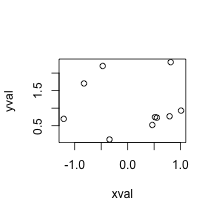
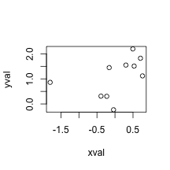
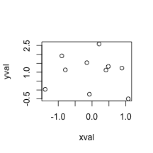
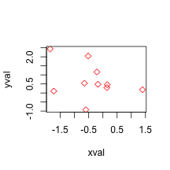

Functions
========================================================
author: Taavi Päll
date: 2017-09-08
autosize: true


A piece of code
========================================================

- A function is a piece of code to carry out a specified task
- It may accept arguments (or not) and it may return zero to more values or objects.

General form of R function
========================================================

General form of R function is following:

```
function(argslist) expr
```

+ **arglist**	-- empty or one or more 'name' or 'name=expression' terms.
+ **expr** -- an R expression.

A piece of code to carry out a specified task
==============================

Example function with no arguments, doing only one thing:

```r
dedication <- function() {
  cat("And Pierce Brosnan how dare you prescribe\n
      Sad grief and bed wet pills")
}
dedication() # to run function
```

```
And Pierce Brosnan how dare you prescribe

      Sad grief and bed wet pills
```

Function interacting with your computer
=============================

Updated function to insert your computer's username into that line instead of that actor:

```r
not_medication <- function() cat(paste("And", system("whoami",T), "how dare you prescribe\n
Sad grief and bed wet pills"))
not_medication() # to run function
```

```
And taavi how dare you prescribe

Sad grief and bed wet pills
```


Specify arguments
========================================================

+ When calling a function you can specify arguments by position, by complete name, or by partial name.


```r
myplot <- function(xval, yval) {
  plot(x = xval, y = yval)
}
myplot(rnorm(10), rnorm(10, 1, 1)) # by position
```



====================================================

by complete name

```r
myplot(xval = rnorm(10), yval = rnorm(10, 1, 1)) # by complete name
```




========================================================

by partial name

```r
myplot(xv = rnorm(10), y = rnorm(10, 1, 1)) # by partial name
```



Naming and braces
===========================================

+ Function names must be concise, [like in previous slides](http://thefall.org/discography/data/album31.html)
+ Multiline function's body must be enclosed by braces `{}`.

Onliners don't need braces:

```r
plusone <- function(x) x + 1
plusone(1)
```

```
[1] 2
```

Local vs global environment
=================================

+ The objects in the function are in a local environment and won’t appear in your global environment

```r
fun1 <- function(x) {
     x + 1 # function returns the result of this expression
}
fun1(1) 
```

```
[1] 2
```


================================

Here, function directs the result into an object y within function environment:

```r
fun2 <- function(x) {
    y <- 3 * x - 1 
}
fun2(5)
```

No result is outputted!
+ `return()` can be used to pass the value of object created inside function to outside.
Can you fix this function?

Default arguments
=================================

+ Some arguments have default values specified 
+ Arguments without a default must have a value supplied


```r
sum_stat <- function(x, f = "mean"){
  do.call(f, list(x))
}

v <- rnorm(10)
sum_stat(v) # by default this function calculates mean
```

```
[1] 0.338282
```

Ellipsis
===================================

+ ... , or ellipsis, in the function definition allows other arguments to be passed into the function, and passed onto to another function:

```r
myplot <- function(xval, yval, ...) plot(x = xval, y = yval, ...)
myplot(rnorm(10), rnorm(10, 1, 1), col = "red", pch = 5) # we pass color and shape arguments to plot function
```



Functional sequence
====================================
+ `%>%` also allows to produce functions
+ sometimes the function is applied instantly and produces a result, and sometimes it is not, in which case the function itself is returned
+ in this case, there is no initial value, so we replace that with the dot `.` placeholder

===================================

Functional sequence:

```r
library(dplyr)
mae <- . %>% abs %>% mean(na.rm = TRUE)
mae(rnorm(10))
```

```
[1] 0.724621
```

This is similar to following function:

```r
mae <- function(x) {
  mean(abs(x), na.rm = TRUE)
}
```

Use of functional sequence inside loop
===================================

Common use case of these functional sequences is inside lapply/sapply:

```r
library(dplyr)
library(readr)
library(reshape2)

data <- paths-to-csv-files %>% 
  lapply(. %>% read_csv %>% melt)
```

Pipes: lambda expressions
=====================
+ Sometimes there is needed more than one operation performed inside one step in pipe.
+ You can define function outside the pipe OR perform these steps inside pipe:


```r
value %>%
  foo %>% {  
    x <- bar(.) 
    y <- baz(.)  
    x * y 
  } %>%
  and_so_on
```


Concluding
====================================

+ Try to keep your functions in separate sub directory lib in your project’s dir
  - load functions using load("lib/cohens_d.R")
+ Good function is:
  - short
  - performs one task
  - has intuitive short name
  
  
Loops
================================

+ 'Looping', 'cycling', 'iterating' or just replicating instructions
  - grouping the parts that need to be repeated
  - automating a multi-step process by organizing sequences of actions or ‘batch’ processes 
 
=================================

Calculate col means of mtcars data using for loop:

```r
means <- c(1:ncol(mtcars))
for(i in seq_along(mtcars)){
  means[[i]] <- mean(mtcars[[i]], na.rm = TRUE)
}
head(means)
```

```
[1]  20.090625   6.187500 230.721875 146.687500   3.596563   3.217250
```
When we want __medians__, we need to repeat all these lines, but replace mean with median. Not very efficient.

  
Apply-sapply-lapply
===================================

+  Functions to manipulate slices of data from matrices, arrays, lists and dataframes in a repetitive way
+ crossing the data in a number of ways and avoid explicit use of loop constructs


=====================================

Lets replace for loop with apply to calculate col means of mtcars:

```r
apply(mtcars[,1:5], 2, mean, na.rm = TRUE) 
```

```
       mpg        cyl       disp         hp       drat 
 20.090625   6.187500 230.721875 146.687500   3.596563 
```
Note, second argument to apply function specifies subscript which the function is applied over. For a matrix **1 indicates rows, 2 indicates columns**.

=====================================
Define your own functions: 

```r
apply(mtcars, 2, function(x) length(x[x<6]))
```

```
 mpg  cyl disp   hp drat   wt qsec   vs   am gear carb 
   0   11    0    0   32   32    0   32   32   32   30 
```


